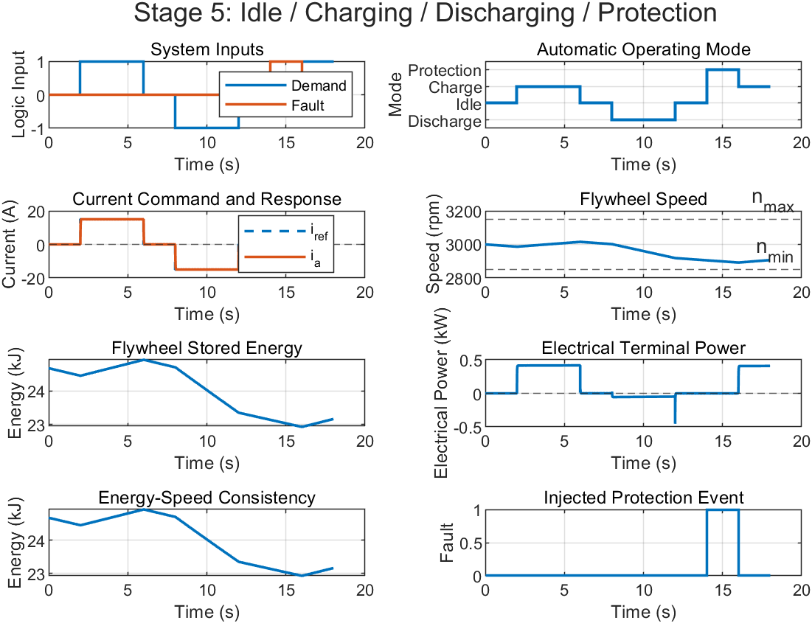

# Flywheel Energy Storage Modeling and Control

MATLAB/Simulink models for a final-year project on urban rail transit braking energy recovery. This repository contains the motor–flywheel modeling and control workstream, developed through five incremental stages.

**Technologies:** MATLAB · Simulink · Dynamic Modeling · Feedback Control · Energy Storage

## Project Overview

The models progress from ideal flywheel dynamics to electromechanical coupling, cascaded control, and operating-mode supervision. Numerical values are provisional test parameters; parameter selection and integration with the wider rail energy-recovery system remain in progress.

## Simulation Stages

| Stage | Script | Purpose |
| --- | --- | --- |
| 1 | `FYP_Flywheel_Stage1_build.m` | Ideal flywheel: torque, speed, energy and mechanical power |
| 2 | `FYP_Flywheel_Stage2_build.m` | Viscous/Coulomb losses and speed protection |
| 3 | `FYP_Flywheel_Stage3_DCServo_build.m` | Open-loop DC motor electrical and flywheel mechanical coupling |
| 4 | `FYP_Flywheel_Stage4_v2_StableClosedLoop_build.m` | Cascaded proportional speed/current control, feedforward and limits |
| 5 | `FYP_Flywheel_Stage5_COMPLETE_v2.m` | Idle, charging, discharging and protection modes |

## Run

Requires MATLAB and Simulink. Set an extracted working copy of this repository as the MATLAB current folder, then run one stage, for example:

```matlab
FYP_Flywheel_Stage5_COMPLETE_v2
```

Each script builds its own model, simulates it and plots results. Scripts replace the matching `.slx` file in the current folder; use a working copy to preserve manually edited models. The supplied models accompany the original scripts; the scripts initialize the workspace parameters needed to reproduce them. MATLAB/Simulink execution has not been rechecked during this repository preparation.

## Core Relationships

- Flywheel energy: `E_f = 0.5 * J_f * omega^2`
- Mechanical dynamics: `J_total * d(omega)/dt = Kt*i - B*omega - Tc*sign(omega)`
- Armature dynamics: `L * di/dt = Va - R*i - Ke*omega`
- Mechanical power: `P = T * omega`

## Example Output



Original Stage 5 output supplied with the project, using temporary simulation parameters. It illustrates operating-mode behavior, rather than measured rail-system performance.

## Engineering Scope

This is an ongoing simulation study. It does not yet establish hardware performance, full train/DC-bus integration, optimized design parameters or experimentally verified recovery efficiency. Stage 4 uses proportional control with compensation; PI control with anti-windup is a possible future comparison.
