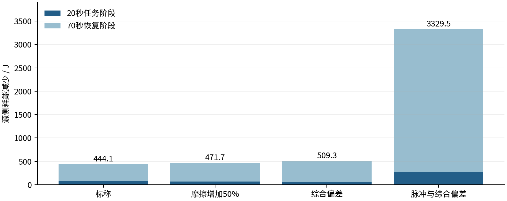

# Integrated rail-load and flywheel simulation

This directory connects synthetic train demand, a DC link, a bidirectional converter, and a DC motor–flywheel plant. It extends the five motor-model stages in the repository root. The separate `research/rail-dispatch` study uses a different aggregate storage model and comparison protocol.

**[中文文件说明](docs/FILE_GUIDE_CN.md)** · **[Full technical report in Chinese](docs/THESIS_DRAFT_CN.md)** · **[Defense questions](docs/DEFENSE_QA_CN.md)**

**[课程要求与执行计划](docs/COURSE_REQUIREMENTS_PLAN_CN.md)** · **[更新分工](docs/TEAM_TASKS_CN.md)** · **[每周 LogBook 模板](docs/templates/LOGBOOK_CN.md)** · **[过程与测试记录模板](docs/templates/RECORDS_CN.md)**

**[当前基线与待办（26 September）](docs/CONTINUITY_BASELINE_CN.md)** · **[需求与测试对应表](docs/REQUIREMENTS_TRACEABILITY_CN.md)**

The plan, cross-checked on 26 September, aligns the project with requirements analysis, design, implementation, testing and evaluation, weekly individual Feishu LogBooks, contribution records and the course assessment. These files are a plan and blank templates; they do not assert completed student submissions, peer reviews or hardware experiments.

## Reproduced evidence

| Evidence | Result | Meaning |
| --- | --- | --- |
| Saved native MATLAB R2024a suite | 11 cases, 322/322 checks | Four paired cases plus three diagnostic cases |
| Saved native Simulink 24.1 run | 67/67 checks | One combined-parameter 90 s case |
| Complete native trace comparison | 9,001 rows, 48 shared columns | Maximum difference about 3.83e-9 in each column's original unit |
| Python reanalysis on 21 September 2026 | All 11 cases passed | File integrity, individual energy stores, loss accounts and terminal comparisons |
| Maximum reanalysed energy residual | 9.66e-6 J | Across all 11 saved cases |
| C++ callback-order reference rerun | 56/56 checks | Scheduling and numerical reference, not a new native MATLAB execution |
| New laboratory analysis tests | 9/9 passed | Analytical synthetic fixtures; no measured hardware data |

The native source snapshots and the `.slx` model are preserved byte for byte. The Python reanalysis and C++ reference were executed while preparing this update. MATLAB/Simulink were not available in that preparation environment; native execution claims refer to the included earlier user-run records. Shared physical routines mean that agreement between MATLAB and Simulink is an implementation check, not independent physical validation.

## Results and comparison boundary

| Case | Baseline source energy J | Dispatch source energy J | Reduction J | Reduction |
| --- | ---: | ---: | ---: | ---: |
| Nominal | 18646.37 | 18202.24 | 444.13 | 2.38% |
| Friction +50% | 29976.19 | 29504.46 | 471.72 | 1.57% |
| Combined parameter deviations | 34770.77 | 34261.44 | 509.33 | 1.46% |
| Pulse demand with combined deviations | 35061.05 | 31731.59 | 3329.46 | 9.50% |

Each pair includes the same 20 s demand task and 70 s restoration. The baseline retains the same spinning flywheel, bypassed during the task. Initial states and demand match; final rotor, inductor and capacitor energies are checked individually. The values are scenario-specific source-energy differences, not measured rail savings or round-trip efficiency.



In the combined-deviation case, only 58.76 J of the 509.33 J total reduction occurs in the task; the remaining 450.57 J occurs during restoration. Task bus-voltage peak decreases from 68.709 V to 67.054 V, but the dispatch minimum remains about 54.367 V. The speed reaches and remains within 1% of 3000 rpm 17.50 s after restoration begins, versus 18.45 s for the bypass baseline. This is a sampled restoration measure, not current-loop step response.

## Open or rerun the model

Requires MATLAB R2024a and Simulink 24.1 for the environment already demonstrated.

1. Keep this directory intact and use it as the MATLAB current folder.
2. Open `FYP_Flywheel_Integrated_20260921_182601.slx`; its model workspace stores its configuration. Keep `FYP_SimulinkSystem_v1.m` next to it.
3. To build a fresh model without simulation, run `FYP_SimulinkSystem_v1('build')`.
4. To build and run the 90 s combined case, run `FYP_SimulinkSystem_v1`. Its earlier native run took about 22 minutes. It writes a separate timestamped directory and `ReviewBundle.zip`.
5. For all 11 MATLAB cases, run `accepted_core/FYP_EnergyDispatch_v1.m` from its directory.

Use a working copy for manual model edits. The original source creates new timestamped outputs. The simulation uses custom Level-2 MATLAB S-function PWM-period maps; it is not a Simscape circuit or a validated code-generation target.

## Check saved results without MATLAB

From this directory:

```bash
python -m pip install -r requirements.txt
python verify_saved_results.py
python -m unittest discover -s tests -v
```

`verify_saved_results.py` reads losslessly compressed CSV files and regenerates `analysis/verified_metrics.json` and `analysis/case_metrics.csv`. `SOURCE_MANIFEST.json` records both compressed and original hashes. Redundant `.mat` and `.fig` copies are omitted from this public directory; the original full package retains them. To restore CSV files for the unchanged MATLAB viewer, run `python prepare_data.py`, then run `FYP_ViewResults_v1` in MATLAB.

For a new numerical scheduler run, with `g++` available:

```bash
python validate_reference.py --run
```

The reference check's legacy output text says native Simulink is pending: that phrase describes the reference checker, which cannot execute Simulink. The subsequent native records in `results/simulink` establish the saved 67-check run. The new reanalysis explicitly distinguishes these evidence levels.

## Future measured data

`lab_analysis.py` processes synchronized `time_s,V_bus_V,I_fess_bus_A,n_rpm` records. Positive branch current enters the complete FESS branch from the bus. Provide confirmed total inertia and complete `handoff/lab_metadata_template.json`; do not copy provisional simulation values into a hardware record.

```bash
python lab_analysis.py actual_measurement.csv --inertia YOUR_CONFIRMED_INERTIA --metadata completed_metadata.json --output lab_output/run_01
```

The inertia placeholder must be replaced with a measured or otherwise justified value in kg·m². The program will not overwrite an existing output directory. It reports round-trip efficiency only when the caller documents a complete, calibrated system boundary and cycle, other internal energy changes, matched terminal energy and low-current endpoints. It does not silently fill missing evidence. The `identify_coastdown` function additionally requires motor-current records and documented zero applied torque. Its tests are synthetic analytical fixtures only.

## Remaining scope

The project brief includes a DC servo/flywheel experimental platform. Actual device and railway parameters, calibration, hardware runs and independent experiment-to-model comparison are still required. PMSM/FOC and PSIM also appear in the brief's tools list and need an advisor's scope decision. They are not implemented here.

The 2850 rpm threshold blocks further active discharge; friction can still lower speed. The 20 A limit applies to the reference, not an absolute instantaneous-current clamp. The 100 Hz saved logs cannot establish 20 kHz current ripple or sub-millisecond response. Final thesis format, contributor details and institutional acceptance remain with the project team and advisor.
