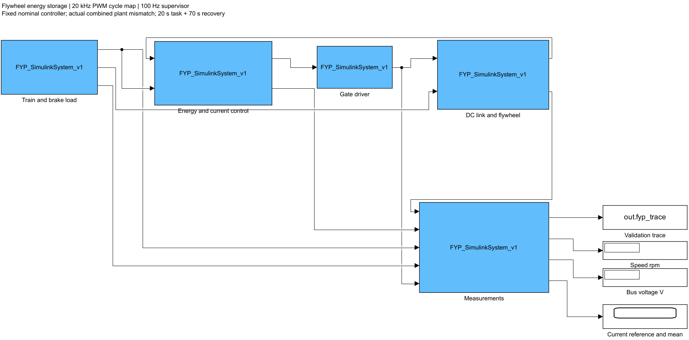
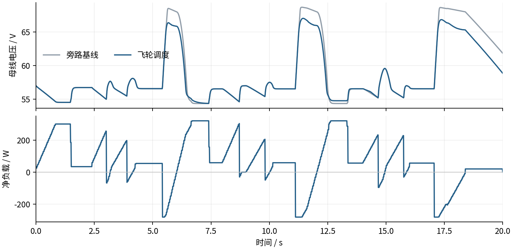
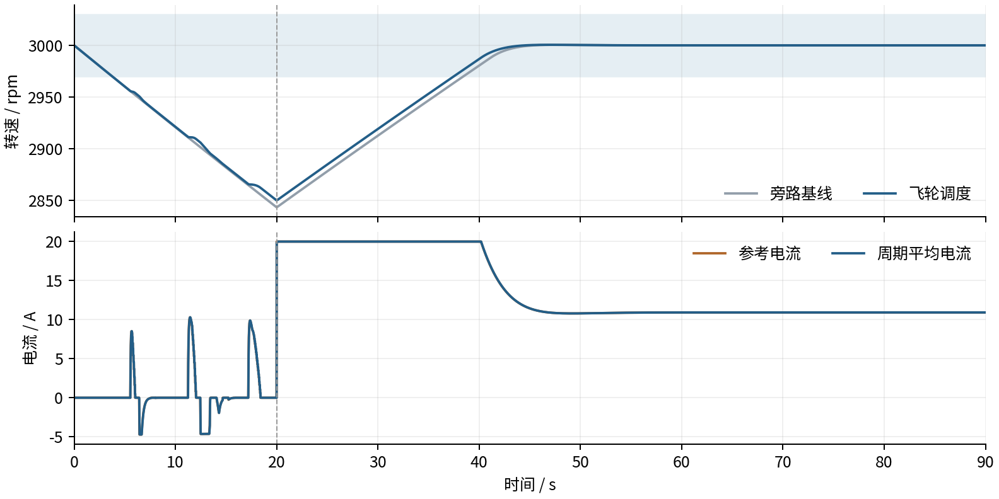

# 飞轮储能系统：模型、控制与仿真报告

Modeling, Control and Simulation of a Flywheel Energy Storage System for Urban Rail Transit Braking Energy Recovery

适用对象：城市轨道交通制动能量回收的直流电机飞轮仿真系统。

[项目说明](../README.md) · [技术问答](TECHNICAL_FAQ_CN.md) · [验证范围与证据](VALIDATION_SCOPE_CN.md)

### 摘要

本研究建立了列车负载、直流母线、双向功率变换、电机飞轮和能量调度相互耦合的仿真系统。电机采用直流等效模型，变流器在20 kHz周期内计算开关、死区及二极管续流，控制器采用电流PI、方向保护和回收信用约束。通过20秒任务与70秒恢复，将旁路基线和调度工况的终端储能配平，再比较源侧输入能量。

现有原生MATLAB结果包含11个工况，322项检查通过；Simulink综合偏差工况67项检查通过。两种入口的9001个采样点、48个共有变量一致。四组配对工况的源侧耗能减少444.13、471.72、509.33和3329.46 J，对应2.38%、1.57%、1.46%和9.50%。综合偏差任务段母线峰值从68.709 V降至67.054 V。以上结论使用暂定器件参数与合成列车输入，尚无实测硬件结果，不能直接外推为实车节能率或往返效率。

### Abstract

An integrated simulation connects synthetic railway demand, a DC link, a bidirectional converter and a DC motor–flywheel plant. Current PI control and recovery-credit supervision coordinate charging and discharging. Four paired experiments include a common 70 s restoration stage after a 20 s task. Source-energy reductions range from 1.46% to 9.50% for the selected cases. Saved native MATLAB and Simulink results agree across 9,001 samples and 48 common variables. The study provides reproducible simulation evidence. The parameters have not been identified from a physical platform, and no hardware validation is reported.

关键词  飞轮储能  再生制动  双向变流  直流电机  能量核算

## 1 研究目标与技术背景

城市轨道车辆的加速和制动形成方向不断变化的功率需求。制动能量能否继续使用，取决于同时存在的牵引负载、储能吸收能力以及母线电压限制。本课题考察飞轮通过电机与双向变流支路吸收再生能量，并在后续负载需要时返还母线的可行性。[1]

已有研究将车载与地面储能协调控制转化为离线优化、规则提取和局部优化，并用线路数据及功率硬件在环实验评价效果。[2] 这说明控制策略的仿真表现与真实平台验证需要分别建立证据。本课题当前聚焦直流电机飞轮支路的能量闭合和可复现控制，不据此宣称新的全局最优算法。

当前实现覆盖合成双车负载、直流母线、双向变流器、直流等效电机飞轮和闭环能量调度。证据来自原生MATLAB与Simulink运行记录及离线复核。PMSM/FOC、PSIM器件仿真和实物实验不属于当前已验证范围。

### 本研究的问题

第一，电机、变流器和母线连接后，能量能否在一致的符号与系统边界下闭合？第二，控制器参数固定时，所选参数偏差下能否维持受限充放电并完成终态恢复？第三，源侧耗能减少发生在任务阶段还是恢复阶段，其结论依赖什么比较条件？

## 2 系统结构与信号边界

负载模块给出列车净功率。能量与电流控制模块读取电流、转速、母线电压和上一周期平均电流，产生占空比与使能。门极驱动执行最小脉冲和死区规则。母线与飞轮模块推进物理状态，测量模块汇总运行轨迹与累计能量。模型工作区保留控制参数和实际被控对象参数。

| 量 | 符号约定 | 用途 |
| --- | --- | --- |
| 列车净负载功率 | 正值为牵引取能，负值为再生注入 | 驱动母线与充放电判断 |
| 飞轮支路母线功率 | 从母线进入支路为正 | 计算支路取能与返还能量 |
| 电机电流 | 正值产生正电磁转矩 | 电流环反馈与机械加速 |
| 电机端功率 | 端电压乘电流 | 区分铜耗与机电功率 |
| 回收信用 | 控制器内部记账量 | 约束放电，不计入物理储能 |

源侧采用单向供电与串联线路电阻。高于源电压时不允许任意向源端送电，富余能量由负载、飞轮或制动电阻消纳。该边界与可回馈电网的变电站不同，因此结论必须连同供电假设一起报告。

## 3 列车动力学与输入缩放

$$
m\frac{dv}{dt}=F_{traction}-F_{brake}-F_{resistance}
$$

列车模型根据区间距离、限速、牵引和制动过程生成速度及功率，阻力采用速度的经验二次式。牵引、再生与辅助功率经效率和母线功率限制转换后，两列车按照时刻偏移叠加，先计入列车间直接能量交换，再将净负载作为储能系统输入。阻力系数当前为继承场景设定，不属于已经实测辨识的系数。

| 项目 | 当前合成场景 |
| --- | --- |
| 列车质量 | 203000 kg |
| 区间长度 | 850 m、1000 m、900 m |
| 区间限速 | 70 km/h、80 km/h、75 km/h |
| 双车偏移 | 35 s |
| 牵引与再生效率 | 均为0.9 |
| 辅助功率与母线功率上限 | 200 kW、3 MW |
| 功率缩放与时间缩放 | α = 0.0001；β = 0.0685344003 |

$$
P_{lab}=\alpha P_{rail},\quad t_{lab}=\beta t_{rail},\quad E_{lab}=\alpha\beta E_{rail}
$$

缩放后的任务长度为20秒，轨迹中的净再生能量约548 J。能量随功率系数与时间系数的乘积缩放。这个关系保证输入轨迹的能量口径，却不保证电机时间常数、线路、电容与机械惯量之间满足完整动力学相似。实验室结果因此不能直接乘回一个系数解释为线路实际性能。

脉冲对照使用独立人工负载，包含牵引与制动脉冲，用于检查较强功率反转下的行为。它的9.50%结果不能当成合成列车场景的普遍节能率。输入生成脚本、配置与轨迹保存在handoff/train_input中。

## 4 电机飞轮与储能模型

$$
L\frac{di}{dt}=v_a-Ri-K_e\omega
$$

$$
J\frac{d\omega}{dt}=K_ti-b\omega-T_c
$$

$$
E_{rot}=\tfrac12J\omega^2,\quad E_{mag}=\tfrac12Li^2,\quad E_{cap}=\tfrac12CV^2
$$

直流电机采用电枢电阻、电感和反电动势描述，电磁转矩与电流成正比。Ke和Kt以SI单位取相同数值以保持机电功率一致；这与直流电机等效模型的基本关系一致。[3] 当前模型研究正转工况，摩擦采用黏性项和库仑项，尚未验证零速静摩擦或反转。

| 参数 | 标称值 | 综合偏差值 | 单位 |
| --- | --- | --- | --- |
| R / L | 0.8 / 0.020 | 1.0 / 0.014 | Ω / H |
| J | 0.51 | 0.65 | kg·m² |
| Ke / Kt | 0.05 / 0.05 | 0.05 / 0.05 | SI |
| b / Tc | 0.001 / 0.05 | 0.0015 / 0.075 | N·m·s/rad / N·m |
| Vs / Rs / C | 60 / 0.30 / 0.10 | 57 / 0.45 / 0.08 | V / Ω / F |
| Ron / Rd / Vf | 0.02 / 0.01 / 0.7 | 0.03 / 0.015 / 0.8 | Ω / Ω / V |
| 死区 / 内层频率 | 1 / 20 | 2 / 20 | μs / kHz |

所有数值均属于当前仿真参数，不是实物额定参数。以标称惯量及3000 rpm计算，初始转子能量约25.17 kJ，而一次缩放任务的净再生输入约0.548 kJ。这说明若直接允许消耗初始转子储能，容易把预先存在的能量误计为本次回收收益。共同终态和信用约束针对这一问题。

## 5 双向变流与能量核算

支路采用在正转速下双向传输功率的开关模型。门极调度显式处理开关导通、关断、死区和二极管续流；周期内电流过零事件与慢状态中点更新共同构成PWM周期映射。变流器损耗分为开关通道、二极管导通、转换、输出电容和栅极驱动项。铜耗与机械摩擦另行累计。

Simulink入口以Level 2 MATLAB S function组织模块，物理状态在Update中推进，Outputs只输出当前值，控制内存保存在块的DWork中。[4] 这有助于固定回调次序和避免重复Outputs改变状态。它仍是自行实现的周期模型，并非Simscape器件电路，也未经过嵌入式代码生成验证。

$$
E_{source}-E_{load}-E_{loss}-\Delta E_{stored}=\varepsilon
$$

储能变化包括转子、电感和母线电容三部分。损耗包含线路、制动电阻、变流器、电枢铜耗、黏性摩擦及库仑摩擦。使用各累计能量与状态量独立重算残差，可检查符号、损耗重复计数和能量遗漏。

| 核算层级 | 应满足的关系 |
| --- | --- |
| 系统边界 | 源能量减净负载、全部损耗及储能变化后接近零 |
| 变流器 | 支路母线能量等于电机端能量加变流器损耗 |
| 电机 | 电机端能量等于铜耗、机电功及电感储能变化 |
| 信用记账 | 余额等于累计获得减累计支出和泄漏 |

独立Python复核11个工况得到最大能量残差约9.66×10⁻⁶ J。这个量说明模型内的数值账本闭合，不能证明暂定参数真实、传感器准确或实际效率已达到要求。数值正确性与物理有效性属于不同的验证层次。

## 6 闭环控制与保护

### 调度层与电流层

调度周期为0.01秒。再生负载且母线升压时请求充电，牵引负载且母线降压时请求放电。有效充电阈值为min(67, max(64, Vinitial+1)) V，放电阈值为Vinitial−0.5 V。配置中的旧Vcharge字段并非当前触发阈值，应以执行代码为准。

$$
i_{ref}=\frac{2P_{target}}{e+\sqrt{e^2+4R_tP_{target}}},\qquad e=K_e\omega
$$

功率指令先经过电机可实现功率范围限制，再转换为参考电流；其中Rt为标称电枢与导通电阻之和。发电电流另受损耗约束和信用余额限制。电流PI在20 kHz周期更新，包含反电动势、电阻及死区补偿，采用条件积分防止饱和期间积分持续增加。Kp为25.1327 V/A，Ki为1030.4424 V/(A·s)。偏差工况仍沿用标称控制器。

### 回收信用与终态恢复

信用余额从零开始，仅在再生负载且请求正向充电时累计保守估计的正机电功；发电支出按负机电功扣除，余额以0.02/s泄漏，并保留5 J储备和0.2秒渐退尺度。记账折扣0.9不是效率参数。控制器不读取真实偏差参数来补偿自身误差。

20秒后负载结束，两支路均进入转速恢复PI，目标为3000 rpm。恢复控制还包含标称摩擦前馈。将恢复输入计入总源能量，可避免只比较任务末端、却忽略储能缺口的情况。

### 保护的实际含义

2850与3150 rpm分别禁止继续主动放电和充电，配有20 rpm软区及5 rpm滞环。它们是方向限制，不对物理转速进行数值裁剪。参考电流限幅为20 A，瞬时电流仍可能轻微超调。综合偏差全周期最低转速约2849.800 rpm；摩擦增加工况约2811.137 rpm，说明停放电并不能抵消持续摩擦。

## 7 验证设计与比较条件

| 工况组 | 数量 | 验证内容 |
| --- | --- | --- |
| 标称旁路与调度 | 2 | 基本能量回收、恢复与源能量比较 |
| 摩擦增加50%旁路与调度 | 2 | 耗散增加及控制器固定时的影响 |
| 综合偏差旁路与调度 | 2 | R L J 母线与器件参数同时改变 |
| 脉冲负载与综合偏差 | 2 | 较强功率反转 |
| 无再生 高源压 信用耗尽 | 3 | 调度约束和边界行为 |

四组配对试验保持相同初始状态、相同负载、相同实际被控对象参数，区别在于任务阶段是否接入飞轮调度。旁路基线仍保留旋转飞轮及其摩擦，双方都经过70秒恢复。它回答的是既定旋转平台上调度相对旁路的能量差，不能替代安装储能与完全无储能系统之间的工程经济比较。

$$
r=\frac{E_{base}-E_{dispatch}}{E_{base}}\times100\%
$$

比较前逐项检查终端转子、电感和电容储能，而不是只看三者相加后是否偶然抵消。四组原生结果的总终端储能差均小于6×10⁻⁷ J；保存的复核同时检查各储能分量。任务阶段和恢复阶段的源能量减少单独报告。

| 证据 | 当前记录 | 解释 |
| --- | --- | --- |
| 原生MATLAB | 11工况 322/322 | 来自已保存的用户运行文件 |
| 原生Simulink | 综合偏差 67/67 | 一组90秒集成回归 |
| 入口一致性 | 9001行 48字段 | 最大绝对差约3.83×10⁻⁹，各列原单位 |
| 保存的Python复核 | 11工况通过 | 逐项能量、文件哈希和终端比较 |
| 保存的C++参考重跑 | 56/56 | 执行次序和数值参考，不是新原生MATLAB运行 |

MATLAB与Simulink复用了同一物理核心，二者一致性支持接口实现正确，但不构成两个独立物理模型的交叉验证。日志间隔0.01秒，用于系统层轨迹分析。开关纹波、亚毫秒响应和真实噪声表现需要单独证据。

## 8 源侧能量结果

| 工况 | 基线 J | 调度 J | 减少 J | 减少比例 |
| --- | --- | --- | --- | --- |
| 标称 | 18646.37 | 18202.24 | 444.13 | 2.38% |
| 摩擦增加50% | 29976.19 | 29504.46 | 471.72 | 1.57% |
| 综合偏差 | 34770.77 | 34261.44 | 509.33 | 1.46% |
| 脉冲与综合偏差 | 35061.05 | 31731.59 | 3329.46 | 9.50% |

综合偏差工况在任务阶段减少58.76 J，恢复阶段减少450.57 J，合计509.33 J。大部分差异体现为任务后恢复所需源能量减少，不能删除恢复过程后继续使用1.46%的结论。脉冲工况同样对恢复过程和初始储能较敏感。

标称任务中，飞轮支路累计从母线取能373.90 J，返还89.98 J；综合偏差分别为375.70 J与77.59 J。取能中含转换与摩擦损耗，任务末端储能又未恢复到初值，因此返还能量除以取能不能直接称为往返效率。约68.23%与68.56%只表示支路正向取能与输入轨迹净再生能量之比。

## 9 母线电压结果

| 指标 | 旁路基线 | 飞轮调度 |
| --- | --- | --- |
| 任务峰值 | 68.709 V | 67.054 V |
| 任务最低值 | 54.351 V | 54.367 V |
| 相对57 V的采样RMS偏差 | 5.046 V | 3.997 V |
| 任务制动电阻耗能 | 337.162 J | 0 J |

峰值与RMS偏差下降说明当前场景下再生升压有所抑制；低谷改善很小，因此不能据此宣布全程母线稳压已经达标。本报告未定义器件允许的电压范围，现有结果不构成设备稳压验收，也不足以判定超限持续时间是否合格。

RMS指标只使用0≤t<20秒的均匀100 Hz日志，排除20秒切入恢复时的参考切换。图用于展示趋势，数值指标由全任务日志计算。该采样率不足以测量20 kHz开关纹波。

## 10 恢复动态与电流跟踪

| 工况 | 旁路恢复时间 s | 调度恢复时间 s | 调度采样电流RMSE A |
| --- | --- | --- | --- |
| 标称 | 8.61 | 7.87 | 0.178 |
| 摩擦增加50% | 19.11 | 18.03 | 0.171 |
| 综合偏差 | 18.45 | 17.50 | 0.190 |
| 脉冲与综合偏差 | 18.45 | 12.27 | 0.402 |

恢复时间定义为从20秒开始计时，转速首次进入2970至3030 rpm并在剩余全部记录点内保持该范围的时间。综合偏差调度为17.50秒，旁路为18.45秒。它描述当前恢复阶段的慢动态，不是电流环阶跃建立时间，也不代表其他初始状态下的响应。

电流RMSE比较任务阶段的周期平均电流与参考电流，使用100 Hz采样。该值受功率切换和采样时刻影响，可用于同一记录口径的对照，不能据此推断模拟电流纹波或200 Hz闭环带宽已经测得。

## 11 实验数据分析工具与适用条件

仓库提供实验数据分析工具，但当前没有实测记录。下表说明工具所需的数据与分析条件，不代表已完成对应实验。电压、电流、转速和保护值依赖所选器件及平台边界，仿真中的60 V、20 A、3000 rpm不能直接作为未知设备的许可设定。

| 分析内容 | 数据与适用条件 | 分析目标 |
| --- | --- | --- |
| 参数与系统边界 | 电机 变流器 飞轮与传感器资料，惯量来源，接线图 | 区分额定值、测量值和控制设定 |
| 滑行试验 | 同步转速与电机电流，无外力与电隔离条件 | 辨识黏性和库仑摩擦 |
| 充电与放电 | 母线电压、整个飞轮支路电流、转速和控制记录 | 核对功率方向与能量变化 |
| 完整循环 | 匹配端点储能、校准和采样信息 | 有条件报告往返效率 |
| 独立复验 | 与辨识数据分开的重复工况 | 比较模型预测与实测误差 |

$$
J[\omega(0)-\omega(t)]=b\int_0^t\omega(\tau)d\tau+T_ct
$$

已补齐的Python分析程序用积分形式拟合正转滑行数据，避免直接微分放大测速噪声；拟合b和Tc时必须给定有依据的总惯量J，并确认电机无施加电磁转矩、无外部负载。不能仅凭母线电流为零就断定电机处于自由滑行。程序要求电机电流记录，并拒绝速度范围不足或条件数过大的拟合。

实验CSV至少记录time_s、V_bus_V、I_fess_bus_A和n_rpm。程序按采样功率的线性插值，在过零处拆分正负能量。元数据须明确传感器校准、完整系统边界、完整循环、其他内部储能变化和终态容差，缺失时保留能量结果但不报告往返效率。

分析程序已通过9项解析和异常输入测试，测试数据全部是人工构造的数值夹具，不是实验。真实数据的偏置、时间错位、采样缺口和不确定度仍需由实验记录评估；输出不会自动把净输入减转子储能的余项解释为全部损耗。

## 12 结论与适用边界

本研究已形成可运行的直流电机飞轮整机仿真，接通合成列车净负载、母线、含非理想损耗的双向变流和闭环能量调度。保存的原生运行及离线独立复核支持能量账本闭合、两种执行入口一致，以及所选四组条件下共同终态的源侧耗能减少。

结果的价值在于明确了控制作用与核算边界：再生升压得到抑制，初始储能的消耗通过恢复与信用约束得到控制，任务和恢复的收益能够拆开检查。当前证据不足以证明实车节能率、硬件可靠性、普遍最优控制或高频纹波性能。

当前参数仍为仿真假设，尚无实测辨识及独立硬件对照。直流等效结果不能直接视为PMSM/FOC或PSIM结果；100 Hz轨迹也不覆盖20 kHz开关纹波及亚毫秒电流动态。仿真阈值用于描述控制行为，不等于实物额定值或安全验收值。

### 与既有研究目录的关系

仓库中的research/rail-dispatch研究调度规则在100个合成场景上的增量收益，其0.0827 kWh结果属于另一套聚合储能与基线定义。本报告的444至3329 J结果来自电机变流器整机模型。二者单位、基线、尺度和控制算法不同，不能合并为同一实验或互相验证节能百分比。

## 13 复现说明与参考资料

整机入口：integrated-system/FYP_SimulinkSystem_v1.m。配套SLX模型为FYP_Flywheel_Integrated_20260921_182601.slx，打开时应保留同目录M文件。MATLAB多工况入口为accepted_core/FYP_EnergyDispatch_v1.m。保存的原生运行使用MATLAB R2024a及Simulink 24.1。

离线复核：在integrated-system目录安装requirements.txt后，运行python verify_saved_results.py。它核对57份冻结输入的哈希并重算11个工况，不需要MATLAB，也不重新生成这些仿真结果。大型CSV采用无损gzip；python prepare_data.py可恢复原文件供MATLAB查看器读取。

独立参考：python validate_reference.py --run需要g++，会重新执行C++回调次序参考。实验分析测试使用python -m unittest discover -s tests -v。原生复现会生成新的时间戳结果目录和ReviewBundle.zip，可连同软件环境信息记录每次运行的输入与输出。

### 参考资料

[1] 李晓东. FYP 2026 099项目任务书. Modeling, Control and Simulation of a Flywheel Energy Storage System for Urban Rail Transit Braking Energy Recovery. 澳门科技大学，内部项目范围文件；非公开实验数据。

[2] Zhong Z, Mi J, Zhao Y, Yang Z, Lin F. Coordinated Control of the Onboard and Wayside Energy Storage System of an Urban Rail Train Based on Rule Mining. Urban Rail Transit, 2024, 10:232–247. https://link.springer.com/article/10.1007/s40864-024-00223-7

[3] MathWorks. DC Motor. 直流电机反电动势、转矩和能量关系。https://www.mathworks.com/help/sps/ref/dcmotor.html  访问日期2026年9月21日。

[4] MathWorks. Write Level 2 MATLAB S Functions. 回调与离散状态接口。https://www.mathworks.com/help/simulink/sfg/writing-level-2-matlab-s-functions.html  访问日期2026年9月21日。

[5] 项目组. FYP EnergyDispatch v1与SimulinkSystem v1原生运行文件，2026年9月21日。数据位置：results/matlab、results/simulink及accepted_native_simulink_audit.json。

[6] 项目组. 已保存复核与派生指标。analysis/verified_metrics.json、case_metrics.csv及verify_saved_results.py。所有结果表与图2至图4均可追溯到上述CSV。

项目地址 https://github.com/chengmiao2005/Flywheel-Energy-Storage-System-MATLAB
