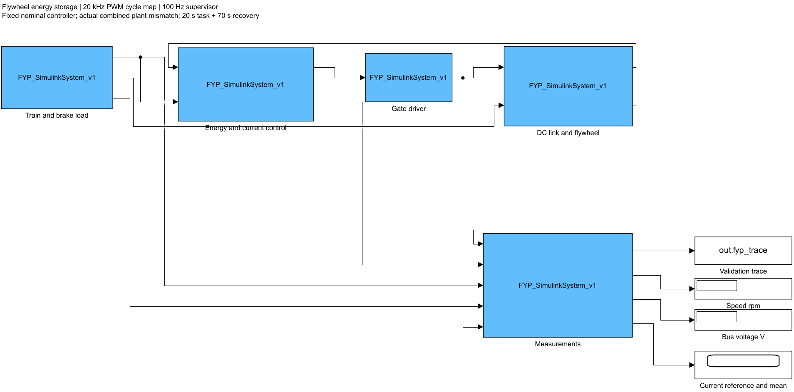
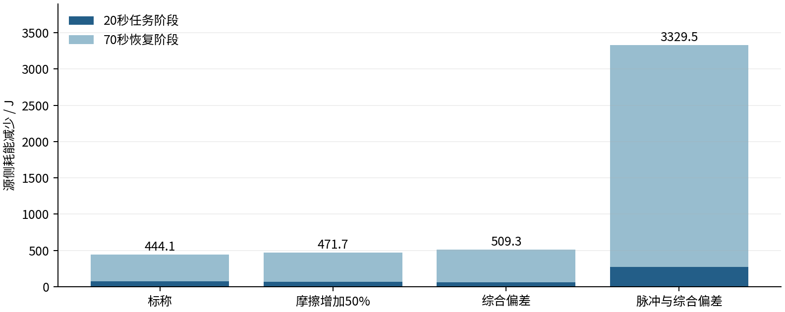
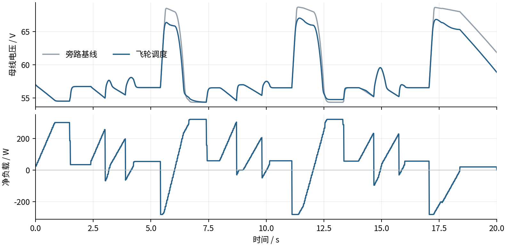
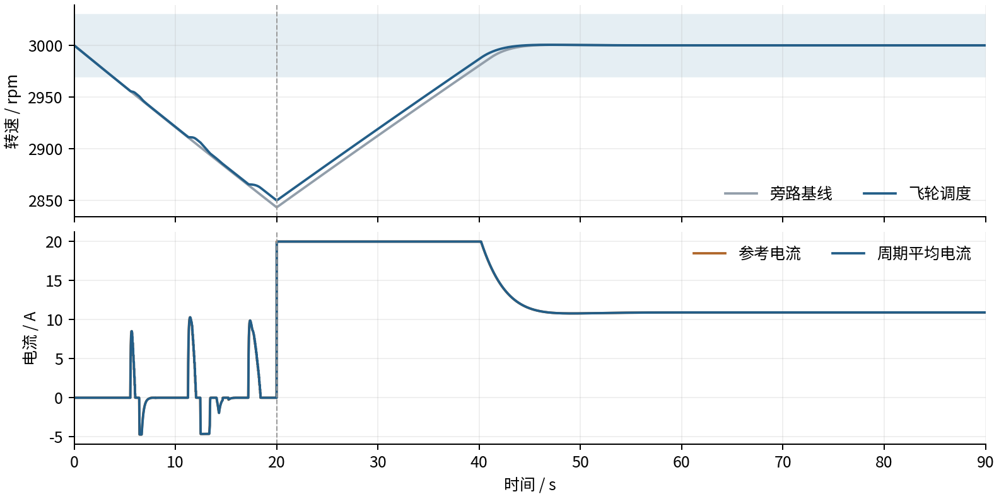
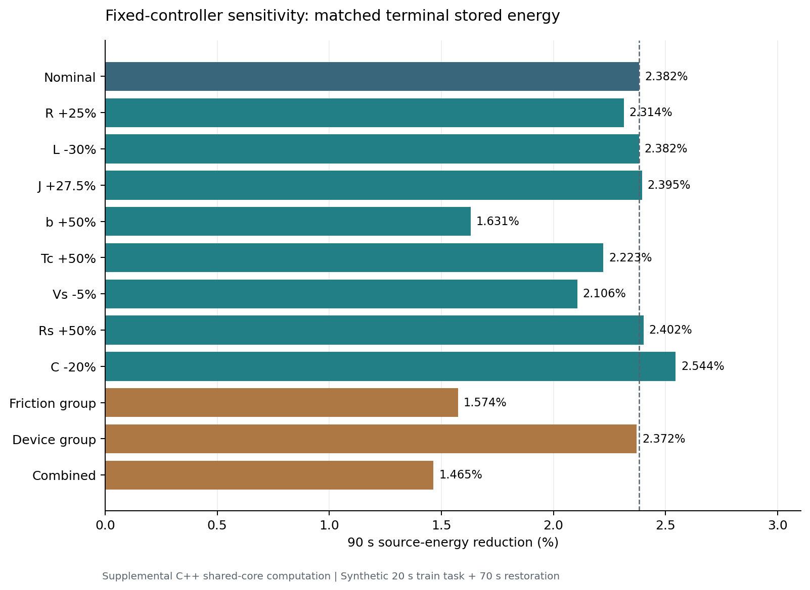
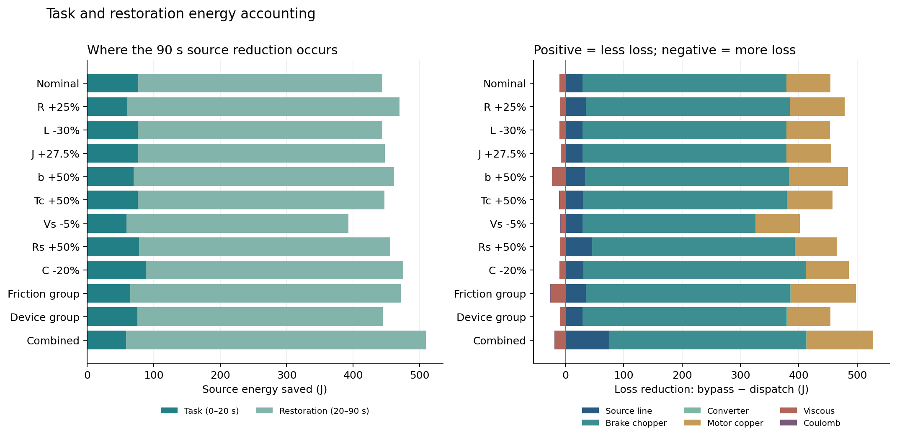

# 城市轨道交通制动能量回收
飞轮储能系统建模控制与仿真

Modeling, Control and Simulation of a Flywheel Energy Storage System for Urban Rail Transit Braking Energy Recovery

澳门科技大学  电子信息方向  FYP 2026 099
项目组  指导教师 李晓东
2026年9月27日  技术报告（仿真与计算验证）

### 摘要

本研究建立了列车负载、直流母线、双向功率变换、电机飞轮和能量调度相互耦合的仿真系统。电机采用直流等效模型，变流器在20 kHz周期内计算开关、死区及二极管续流，控制器采用电流PI、方向保护和回收信用约束。通过20秒任务与70秒恢复，将旁路基线和调度工况的终端储能配平，再比较源侧输入能量。

现有原生MATLAB结果包含11个工况，322项检查通过；Simulink综合偏差工况67项检查通过。两种入口的9001个采样点、48个共有变量一致。四组配对工况的源侧耗能减少444.13、471.72、509.33和3329.46 J，对应2.38%、1.57%、1.46%和9.50%。综合偏差任务段母线峰值从68.709 V降至67.054 V。以上结论使用暂定器件参数与合成列车输入，尚无实测硬件结果，不能直接外推为实车节能率或往返效率。

本轮进一步执行了12组成对C++参数试验，全部通过共同终态核对；948项数值检查中945项通过，3项约10⁻⁷ J的严格辅助账本诊断保留。新增离线实测数据接入工具通过18项合成检查，上述工作均不属于硬件实验。

### Abstract

An integrated simulation connects synthetic railway demand, a DC link, a bidirectional converter and a DC motor–flywheel plant. Current PI control and recovery-credit supervision coordinate charging and discharging. Four paired experiments include a common 70 s restoration stage after a 20 s task. Source-energy reductions range from 1.46% to 9.50% for the selected cases. Saved native MATLAB and Simulink results agree across 9,001 samples and 48 common variables. The study provides reproducible simulation evidence. Measured parameter identification and hardware validation remain outside the current evidence.

关键词  飞轮储能  再生制动  双向变流  直流电机  能量核算

## 1 研究目标与技术背景

城市轨道车辆的加速和制动形成方向不断变化的功率需求。制动能量能否继续使用，取决于同时存在的牵引负载、储能吸收能力以及母线电压限制。本课题考察飞轮通过电机与双向变流支路吸收再生能量，并在后续负载需要时返还母线的可行性。[1]

已有研究将车载与地面储能协调控制转化为离线优化、规则提取和局部优化，并用线路数据及功率硬件在环实验评价效果。[2] 这说明控制策略的仿真表现与真实平台验证需要分别建立证据。本课题当前聚焦直流电机飞轮支路的能量闭合和可复现控制，不据此宣称新的全局最优算法。

| 研究范围 | 现有对应成果 | 未验证的范围 |
| --- | --- | --- |
| 车辆与飞轮动力学 | 双车合成负载、DC电机及飞轮方程 | 列车与器件参数来源 |
| 双向DC/DC设计 | PWM、死区、二极管及损耗模型 | 实物选型、接线及器件约束 |
| 闭环能量协调 | 电流PI、回收信用和方向保护 | 真实测量与工况验证 |
| 集成仿真与实验平台 | 原生MATLAB与Simulink运行记录 | DC伺服飞轮实物平台 |
| 效率 电压 动态分析 | 能量比较、电压与恢复动态 | 实测效率、高频纹波及独立阶跃测试 |

任务书正文提出DC伺服实验台，同时工具栏列出PMSM/FOC和PSIM。本研究的实现和证据限定于直流等效模型，未实现PMSM/FOC或PSIM。[1]


### 相关研究与本项目定位

除控制算法外，已有研究也强调验证层次。Ceraolo 等使用 MATLAB/Simscape 与 Modelica 建立铁路模型，并结合实际列车数据验证，再讨论储能方案的成本与年度节能。[9] Yamashita 等报告了超导磁轴承飞轮原型的充放电与可靠性测试；其中的长期悬浮和循环试验属于具体实物部件的证据。[10] 它们说明，数值模型、线路数据和设备可靠性需要不同类型的验证。

| 原始研究 | 主要关注点 | 对本项目的启示 | 不直接迁移的内容 |
| --- | --- | --- | --- |
| Zhong 等，2024 [2] | 车载与地面储能协调、规则提取与局部优化 | 明确调度问题、比较条件和验证平台 | 算法、线路数据和论文中的收益 |
| Ceraolo 等，2018 [9] | 铁路再生制动建模、数据验证及方案可行性 | 从系统模型到工程效益需要实际数据支持 | 高速列车工况、器件配置和成本结论 |
| Yamashita 等，2017 [10] | 超导磁轴承飞轮原型与部件可靠性 | 飞轮实物验证还包括轴承、循环和持续运行 | 其磁轴承结构、试验结果与额定能力 |

本项目的定位是直流等效整机仿真与可追溯核算：将输入、机电动态、开关损耗、调度和共同终态比较放在同一证据链中。这里不主张提出了普遍最优的新算法，也不使用文献中的装置参数替代本项目尚未获得的实测来源。

### 本研究的问题

第一，电机、变流器和母线连接后，能量能否在一致的符号与系统边界下闭合？第二，控制器参数固定时，所选参数偏差下能否维持受限充放电并完成终态恢复？第三，源侧耗能减少发生在任务阶段还是恢复阶段，其结论依赖什么比较条件？

## 2 系统结构与信号边界



负载模块给出列车净功率。能量与电流控制模块读取电流、转速、母线电压和上一周期平均电流，产生占空比与使能。门极驱动执行最小脉冲和死区规则。母线与飞轮模块推进物理状态，测量模块汇总运行轨迹与累计能量。模型工作区保留控制参数和实际被控对象参数。

| 量 | 符号约定 | 用途 |
| --- | --- | --- |
| 列车净负载功率 | 正值为牵引取能，负值为再生注入 | 驱动母线与充放电判断 |
| 飞轮支路母线功率 | 从母线进入支路为正 | 计算支路取能与返还能量 |
| 电机电流 | 正值产生正电磁转矩 | 电流环反馈与机械加速 |
| 电机端功率 | 端电压乘电流 | 区分铜耗与机电功率 |
| 回收信用 | 控制器内部记账量 | 约束放电，不计入物理储能 |

源侧采用单向供电与串联线路电阻。高于源电压时不允许任意向源端送电，富余能量由负载、飞轮或制动电阻消纳。该边界与可回馈电网的变电站不同，因此结论必须连同供电假设一起报告。


### 方案选择与取舍

本报告采用直流电机等效模型，是为了直接建立“电流—转矩—转速—储能”的关系，并与任务书中的 DC 伺服平台方向对应。该模型保留电枢电感、电阻、反电动势和机械摩擦，适合检查能量流向及控制作用；它没有三相电流、转子电角度和 d/q 轴变量，因而不能用于论证 PMSM 磁场定向控制的性能。

| 设计选择 | 本项目采用的方式 | 得到的能力与限制 |
| --- | --- | --- |
| 电机 | DC 电机与总惯量耦合 | 可解释机电能量转换；不覆盖三相换相与磁饱和 |
| 电源 | 电压源、串联电阻、单向供电 | 保留线路压降和不能回馈源端的边界；不代表所有牵引变电站 |
| 变流器 | PWM 周期内分段电流映射 | 记录开关、死区、续流及损耗；不包含寄生振荡和器件热网络 |
| 调度 | 母线阈值、功率约束、回收信用 | 规则可追踪、参数可复核；未求解全局最优运行轨迹 |
| 平台 | MATLAB 多工况与 Simulink 模块化入口 | 易检查数值与接口；共享物理核心限制了验证独立性 |

这里的选择是研究范围与可解释性的取舍。复杂模型只有在参数与验证资料足够时才能增加可信度；本项目没有用增加模块名称代替物理验证。

## 3 列车动力学与输入缩放

$$
m\frac{dv}{dt}=F_{traction}-F_{brake}-F_{resistance}
$$

列车模型根据区间距离、限速、牵引和制动过程生成速度及功率，阻力采用速度的经验二次式。牵引、再生与辅助功率经效率和母线功率限制转换后，两列车按照时刻偏移叠加，先计入列车间直接能量交换，再将净负载作为储能系统输入。阻力系数当前为继承场景设定，不能在论文中写成已经实测辨识的系数。

| 项目 | 当前合成场景 |
| --- | --- |
| 列车质量 | 203000 kg |
| 区间长度 | 850 m、1000 m、900 m |
| 区间限速 | 70 km/h、80 km/h、75 km/h |
| 双车偏移 | 35 s |
| 牵引与再生效率 | 均为0.9 |
| 辅助功率与母线功率上限 | 200 kW、3 MW |
| 功率缩放与时间缩放 | α = 0.0001；β = 0.0685344003 |

$$
P_{lab}=\alpha P_{rail},\quad t_{lab}=\beta t_{rail},\quad E_{lab}=\alpha\beta E_{rail}
$$

缩放后的任务长度为20秒，轨迹中的净再生能量约548 J。能量随功率系数与时间系数的乘积缩放。这个关系保证输入轨迹的能量口径，却不保证电机时间常数、线路、电容与机械惯量之间满足完整动力学相似。实验室结果因此不能直接乘回一个系数解释为线路实际性能。

脉冲对照使用独立人工负载，包含牵引与制动脉冲，用于检查较强功率反转下的行为。它的9.50%结果不能当成合成列车场景的普遍节能率。输入生成脚本、配置与轨迹保存在handoff/train_input中。

## 4 电机飞轮与储能模型

$$
L\frac{di}{dt}=v_a-Ri-K_e\omega
$$

$$
J\frac{d\omega}{dt}=K_ti-b\omega-T_c
$$

$$
E_{rot}=\tfrac12J\omega^2,\quad E_{mag}=\tfrac12Li^2,\quad E_{cap}=\tfrac12CV^2
$$

直流电机采用电枢电阻、电感和反电动势描述，电磁转矩与电流成正比。Ke和Kt以SI单位取相同数值以保持机电功率一致；这与直流电机等效模型的基本关系一致。[3] 当前模型研究正转工况，摩擦采用黏性项和库仑项，尚未验证零速静摩擦或反转。

| 参数 | 标称值 | 综合偏差值 | 单位 |
| --- | --- | --- | --- |
| R / L | 0.8 / 0.020 | 1.0 / 0.014 | Ω / H |
| J | 0.51 | 0.65 | kg·m² |
| Ke / Kt | 0.05 / 0.05 | 0.05 / 0.05 | SI |
| b / Tc | 0.001 / 0.05 | 0.0015 / 0.075 | N·m·s/rad / N·m |
| Vs / Rs / C | 60 / 0.30 / 0.10 | 57 / 0.45 / 0.08 | V / Ω / F |
| Ron / Rd / Vf | 0.02 / 0.01 / 0.7 | 0.03 / 0.015 / 0.8 | Ω / Ω / V |
| 死区 / 内层频率 | 1 / 20 | 2 / 20 | μs / kHz |

所有数值均属于当前仿真参数，不是实物额定参数。以标称惯量及3000 rpm计算，初始转子能量约25.17 kJ，而一次缩放任务的净再生输入约0.548 kJ。这说明若直接允许消耗初始转子储能，容易把预先存在的能量误计为本次回收收益。共同终态和信用约束针对这一问题。


### 母线、电源与制动电阻

母线不是固定的 57 V 常数。代码把母线电容电压作为动态状态，按照进入与离开母线的功率差计算其变化：

$$
CV\frac{dV}{dt}=VI_s-P_{load}-P_{fess}-P_{chop}
$$

其中 $P_{load}>0$ 表示列车牵引取能，$P_{load}<0$ 表示净再生；$P_{fess}>0$ 表示飞轮支路从母线取能。模型中的源电流为：

$$
I_s=\max\left(\frac{V_s-V}{R_s},0\right)
$$

所以母线低于源电压时，电源经过线路电阻供电；母线高于源电压时源电流为零。源端输入功率为 $V_sI_s$，到达母线的功率为 $VI_s$，二者差值为线路损耗 $R_sI_s^2$。

制动电阻使用连续占空比近似：

$$
d_{chop}=\operatorname{clip}\left(\frac{V-68}{2},0,1\right),\qquad P_{chop}=d_{chop}\frac{V^2}{6}
$$

也就是 68 V 以下关闭，68—70 V 逐步增加消耗，达到 70 V 时全导通。电阻是 6 Ω 的仿真假设。以上是制动电阻的平均功率模型；其开关细节不与飞轮支路的 PWM 事件模型混为一谈。

负载、电源和飞轮支路同时作用于同一个电容：再生注入超过吸收能力，母线电压上升；牵引消耗超过供能能力，母线电压下降。飞轮支路通过改变电流改变吸收或返还功率，因此能影响母线电压。

### 参数来自哪里，以及这些数值意味着什么

本项目的参数来源应分为三类：一是模型假设，如电阻、电感、惯量、摩擦和器件损耗参数；二是控制设置，如电流上限、转速方向限制和 PI 增益；三是诊断场景，如综合偏差。参数登记表记录的是当前程序值及其位置，不是某台设备的厂家规格。MathWorks 文档支持模型关系，不支持本项目具体的 0.51 kg·m² 或 60 V 选型。

57 V 来自综合偏差场景：源电压从名义 60 V 减少 5%，同时将线路电阻从 0.30 Ω 提高到 0.45 Ω，将电容从 0.10 F 降到 0.08 F。该组合用于观察供电条件变弱时的运行行为；57 V 不是轨道交通母线额定制式，也不是已选硬件的工作电压证明。

下面的计算是对既有参数的数量级检查，不把事后计算写成已经完成的器件设计：

| 检查量 | 标称值 | 综合偏差值 | 含义 |
| --- | ---: | ---: | --- |
| 3000 rpm 对应角速度 | 314.159 rad/s | 314.159 rad/s | 初始化值，由 rpm 转成 SI 单位 |
| 3000 rpm 的反电动势 | 15.708 V | 15.708 V | 低于当前母线电压，处于代码使用的正转有效域 |
| 电气时间常数 $L/(R+R_{on})$ | 24.39 ms | 13.59 ms | 说明电感与电阻对电流变化速度的影响 |
| 3000 rpm 的摩擦功率 | 114.40 W | 171.61 W | 在本模型中不能忽略的持续耗散 |
| 克服该摩擦的平均电流 | 7.283 A | 10.925 A | 来自 $(b\omega+T_c)/K_t$，影响恢复耗能 |
| 3000 rpm 的初始转子能量 | 25.17 kJ | 32.08 kJ | 明显大于本次净再生输入，必须控制初始能量的使用 |
| 2850—3150 rpm 的理论能量差 | 5.03 kJ | 6.42 kJ | 仅为给定惯量与转速区间的计算值，不是保证可用容量 |

转速区间的理论能量差没有扣除摩擦、电气损耗、功率限制和信用限制。尤其本模型的摩擦功率较大，会明显影响旁路滑行和随后恢复的源能量；因此当前结果必须与摩擦假设一并报告，不能直接当成高效实物飞轮的性能。

20 A 在程序中是参考电流限制。按名义参数、3000 rpm 估算，正 20 A 对应电磁转矩 1 N·m，电磁功率约 314 W；它并不等于母线侧 20 A，也不能直接用母线电压乘以该电流当作飞轮支路输入功率。

## 5 双向变流与能量核算

支路采用在正转速下双向传输功率的开关模型。门极调度显式处理开关导通、关断、死区和二极管续流；周期内电流过零事件与慢状态中点更新共同构成PWM周期映射。变流器损耗分为开关通道、二极管导通、转换、输出电容和栅极驱动项。铜耗与机械摩擦另行累计。

Simulink入口以Level 2 MATLAB S function组织模块，物理状态在Update中推进，Outputs只输出当前值，控制内存保存在块的DWork中。[4] 这有助于固定回调次序和避免重复Outputs改变状态。它仍是自行实现的周期模型，并非Simscape器件电路，也未经过嵌入式代码生成验证。

$$
E_{source}-E_{load}-E_{loss}-\Delta E_{stored}=\varepsilon
$$

储能变化包括转子、电感和母线电容三部分。损耗包含线路、制动电阻、变流器、电枢铜耗、黏性摩擦及库仑摩擦。使用各累计能量与状态量独立重算残差，可检查符号、损耗重复计数和能量遗漏。

| 核算层级 | 应满足的关系 |
| --- | --- |
| 系统边界 | 源能量减净负载、全部损耗及储能变化后接近零 |
| 变流器 | 支路母线能量等于电机端能量加变流器损耗 |
| 电机 | 电机端能量等于铜耗、机电功及电感储能变化 |
| 信用记账 | 余额等于累计获得减累计支出和泄漏 |

独立Python复核11个工况得到最大能量残差约9.66×10⁻⁶ J。这个量说明模型内的数值账本闭合，不能证明暂定参数真实、传感器准确或实际效率已达到要求。数值正确性与物理有效性属于不同的验证层次。


### 从公式到源码

整机核心文件是 `FYP_SimulinkSystem_v1.m`，`.slx` 文件负责连接模块与调度执行。程序按模块类型调用同一文件中的不同局部函数。建模时应保留二者配套，修改参数后用主程序重新构建并保存新运行结果。

| 物理或控制功能 | 程序位置 | 关键状态或输出 |
| --- | --- | --- |
| 初始条件 | `sl_case`、`sl_initialize` | 3000 rpm、57 V、零电流 |
| 电机电流 | `current_moments`、`electrical_piece` | `y(1)`；电枢电阻、电感、反电动势 |
| 飞轮转速 | `midpoint_step` | `y(2)`；电磁转矩与两类摩擦 |
| 母线电压 | `midpoint_step` | `y(3)`；电容功率平衡 |
| 列车输入 | `embedded_train_profile`、`sl_load`、`load_integrals` | 净负载功率及周期内负载能量 |
| 能量调度 | `outer_control` | 参考电流、充放电功率请求、转速方向限制 |
| 电流 PI 与信用 | `sl_control` | 占空比、积分状态、信用余额 |
| 门极与非理想损耗 | `sl_driver`、`gate_schedule`、`event_heat` | 最小脉冲、死区、开关事件能量 |
| 总能量与日志 | `energy`、`balance`、`make_row` | 三项储能、累计能量、残差与具名数据列 |
| 输出验证 | `check_simulink` | 完整日志、参考一致性、终态及能量恒等式 |

`y` 的前 3 个位置是动态状态，其余位置主要是累计量。例如 `y(4)` 为源能量，`y(5)` 为线路损耗，`y(6)` 为净负载能量，`y(17)` 为电流积分。回收信用属于控制器内存，不加入这些物理储能。

每个 PWM 周期，`sl_plant` 先由占空比生成门极时间片，再调用 `midpoint_step`。电气部分在各导通片段内计算电流及其一、二阶时间积分；慢变量使用转速和母线电压的中点值迭代耦合。新的 `y(1:3)` 写回当前状态。程序不是用 100 Hz 的日志间隔推进飞轮，也不是用简单前向欧拉一次跳过全部开关过程。

### 转速和母线的离散更新

记一个周期的时间为 $h$，中点速度和电压为 $\omega_m=(\omega_0+\omega_1)/2$、$V_m=(V_0+V_1)/2$，周期电流积分为 $Q_i=\int i\,dt$，则代码的转速更新可写为：

$$
\omega_1=\frac{\omega_0(1-bh/(2J))+(K_tQ_i-T_ch)/J}{1+bh/(2J)}
$$

母线更新按同一周期的能量计算：

$$
V_1=V_0+\frac{V_mI_sh-W_{load}-W_{fess}-P_{chop}h}{CV_m}
$$

这里的 $W$ 是该周期内的能量，不能与瞬时功率混用。电流映射依赖 $V_m$ 和 $\omega_m$，因此两个式子在一个周期内迭代，直到程序设定的数值缺陷阈值满足。这个迭代终止值衡量数值收敛，不代表传感器精度或模型对实物的误差。

### 20 kHz、100 Hz 和输出点数

| 层次 | 周期或频率 | 实际作用 |
| --- | --- | --- |
| PWM 与物理状态推进 | 50 μs，20 kHz | 每周期解析开关片段并更新电流、转速和母线 |
| 电流控制 | 50 μs，20 kHz | 利用上一周期平均电流计算本周期指令 |
| 能量调度与恢复速度控制 | 0.01 s，100 Hz | 每 200 个 PWM 周期更新参考电流 |
| 保存日志 | 0.01 s，100 Hz | 每 200 个周期保存一次轨迹，90 s 共 9001 点 |

100 Hz 调度和 100 Hz 日志恰好相同，但用途不同。常规轨迹是抽样保存，不是把所有高频波形完整存入 CSV。程序还保存某些累计极值，例如全周期电流峰值；这些标量只能支持相应极值检查，不能恢复完整开关纹波。

## 6 闭环控制与保护

### 调度层与电流层

调度周期为0.01秒。再生负载且母线升压时请求充电，牵引负载且母线降压时请求放电。有效充电阈值为min(67, max(64, Vinitial+1)) V，放电阈值为Vinitial−0.5 V。配置中的旧Vcharge字段并非当前触发阈值，应以执行代码为准。

$$
i_{ref}=\frac{2P_{target}}{e+\sqrt{e^2+4R_tP_{target}}},\qquad e=K_e\omega
$$

功率指令先经过电机可实现功率范围限制，再转换为参考电流；其中Rt为标称电枢与导通电阻之和。发电电流另受损耗约束和信用余额限制。电流PI在20 kHz周期更新，包含反电动势、电阻及死区补偿，采用条件积分防止饱和期间积分持续增加。Kp为25.1327 V/A，Ki为1030.4424 V/(A·s)。偏差工况仍沿用标称控制器。

### 回收信用与终态恢复

信用余额从零开始，仅在再生负载且请求正向充电时累计保守估计的正机电功；发电支出按负机电功扣除，余额以0.02/s泄漏，并保留5 J储备和0.2秒渐退尺度。记账折扣0.9不是效率参数。控制器不读取真实偏差参数来补偿自身误差。

20秒后负载结束，两支路均进入转速恢复PI，目标为3000 rpm。恢复控制还包含标称摩擦前馈。将恢复输入计入总源能量，可避免只比较任务末端、却忽略储能缺口的情况。

### 保护的实际含义

2850与3150 rpm分别禁止继续主动放电和充电，配有20 rpm软区及5 rpm滞环。它们是方向限制，不对物理转速进行数值裁剪。参考电流限幅为20 A，瞬时电流仍可能轻微超调。综合偏差调度工况全周期最低转速约2849.800 rpm；摩擦增加调度工况约2811.137 rpm，说明停放电并不能抵消持续摩擦。


### 电流 PI 数值如何得到

忽略反电动势扰动、死区和饱和，名义电气对象可近似为 $G(s)=1/(Ls+R_t)$，其中 $R_t=R+R_{on}=0.82\ \Omega$。代码选取设计尺度 $\omega_c=2\pi\times200$ rad/s，再令：

$$
K_p=L\omega_c=25.1327,\qquad K_i=R_t\omega_c=1030.4424
$$

在理想反馈环的近似下，这组 PI 零点与对象电气极点相消，得到约 $\omega_c/s$ 的开环形式。这解释了增益的来源。实际代码另有参考电流电阻前馈、反电动势前馈、死区补偿、采样延迟、最小脉冲和限幅，因此“200 Hz”只能称为名义整定尺度，不能写成已经测得的闭环带宽。

标称控制器在所有偏差工况中保持固定，实际对象可改变 $R,L,J,b,T_c$ 等参数。这种分离用于观察模型失配的影响。若把实际对象参数直接偷偷送回控制器，试验就不能再说明固定控制器在失配下的表现。

### 指令、保护与数值有效域分开解释

电流参考限幅、转速方向禁止以及最小脉冲属于控制与驱动规则。代码中的 $40<V<85$ V、$\omega>0$ 和 $0<K_e\omega<V$ 等断言，则是在发现求解状态超出当前模型有效域时终止运行；它们不是硬件欠压、过压或超速保护的实现证明。

最小脉冲比例为 $2.2t_df_{sw}$：标称为 0.044，综合偏差为 0.088。过短的导通或关断指令会被驱动规则折算为 0 或 1，占空比与平均输出之间因此不再在整个范围内完全线性。

## 7 验证设计与比较条件

| 工况组 | 数量 | 验证内容 |
| --- | --- | --- |
| 标称旁路与调度 | 2 | 基本能量回收、恢复与源能量比较 |
| 摩擦增加50%旁路与调度 | 2 | 耗散增加及控制器固定时的影响 |
| 综合偏差旁路与调度 | 2 | R L J 母线与器件参数同时改变 |
| 脉冲负载与综合偏差 | 2 | 较强功率反转 |
| 无再生 高源压 信用耗尽 | 3 | 调度约束和边界行为 |

四组配对试验保持相同初始状态、相同负载、相同实际被控对象参数，区别在于任务阶段是否接入飞轮调度。旁路基线仍保留旋转飞轮及其摩擦，双方都经过70秒恢复。它回答的是既定旋转平台上调度相对旁路的能量差，不能替代安装储能与完全无储能系统之间的工程经济比较。

$$
r=\frac{E_{base}-E_{dispatch}}{E_{base}}\times100\%
$$

比较前逐项检查终端转子、电感和电容储能，而不是只看三者相加后是否偶然抵消。四组原生结果的总终端储能差均小于6×10⁻⁷ J；新增复核同时检查各储能分量。任务阶段和恢复阶段的源能量减少单独报告。

| 证据 | 当前记录 | 解释 |
| --- | --- | --- |
| 原生MATLAB | 11工况 322/322 | 来自已保存的用户运行文件 |
| 原生Simulink | 综合偏差 67/67 | 一组90秒集成回归 |
| 入口一致性 | 9001行 48字段 | 最大绝对差约3.83×10⁻⁹，各列原单位 |
| Python离线复核 | 11工况通过 | 逐项能量、文件哈希和终端比较 |
| C++参考重跑 | 56/56 | 执行次序和数值参考，不是新原生MATLAB运行 |

MATLAB与Simulink复用了同一物理核心，二者一致性支持接口实现正确，但不构成两个独立物理模型的交叉验证。日志间隔0.01秒，用于系统层轨迹分析。开关纹波、亚毫秒响应和真实噪声表现需要单独证据。


### 2026年9月27日的软件复核

本轮在隔离副本中实际重算既有轨迹、重新编译执行 C++ 调度参考，并增加了配对条件和保护方向检查。原生 MATLAB/Simulink 检查数量属于原有记录；本轮没有在对应原生环境重新运行。

| 本轮复核项目 | 结果 | 证据含义 |
| --- | --- | --- |
| 保存数据重分析 | 11 工况通过；57 份基准清单文件哈希通过 | 已有数据与冻结清单一致，数值可重算 |
| 完整包输入保护 | 69 份输入文件逐项哈希不变 | 复核未改写原有证据 |
| 公开包兼容性 | 68 份输入保护；20个压缩CSV临时解压 | 公开布局只对缺失MAT比较标记跳过，其余必需审计继续 |
| 原生记录核对 | MATLAB 322/322；Simulink 67/67 | 逐项核对已保存数值与限值 |
| 模型静态结构 | 14 条连线一致；50 μs 步长；0—90 s | SLX 文件内配置与结构核对 |
| 新 C++ 参考执行 | 56/56 | 90 s 调度与数值参考运行 |
| 新增比较与保护检查 | 213/213 | 同参数、同时间、固定控制器和方向规则 |

记录保存在 `verification/runs/recovered_full_20260927/` 与 `recovered_public_20260927/`。完整布局的MAT/CSV比较最大差约 $5.09\times10^{-11}$；公开布局缺少MAT时明确标记SKIPPED，不伪造数据。MATLAB、Simulink与C++共用同一物理算法，新增检查提高了实现和复现证据的完整性，没有把它们变成相互独立的物理模型。

### 公平比较的验收顺序

先检查两条轨迹的初始状态、实际参数、输入负载和仿真时长一致；再检查终点转子、电感和电容储能分别接近；最后计算源侧能量差。三项终端能量的总和接近并不充分，因为不同储能分量可能互相抵消。

共同恢复到 3000 rpm 是本试验协议的一部分。终态并不要求每项储能恰好等于其初始值，例如起始电流为零，而最终需要非零平均电流克服摩擦；公平性来自两条工况终态相匹配。终态仍存在未补偿差异时，可以报告各自轨迹和能量，但不能把原始源能量差作为完全可比的节能结果。

节能比例的分母包含 90 s 的源端能量，且旁路仍有旋转飞轮摩擦。因此本试验回答“已经存在并旋转的飞轮支路，加入当前调度后怎样变化”，不回答“安装飞轮是否比完全不装飞轮更经济”。固定的 70 s 恢复也应与结果一并说明；改变恢复协议可能改变比例。

## 8 源侧能量结果

| 工况 | 基线 J | 调度 J | 减少 J | 减少比例 |
| --- | --- | --- | --- | --- |
| 标称 | 18646.37 | 18202.24 | 444.13 | 2.38% |
| 摩擦增加50% | 29976.19 | 29504.46 | 471.72 | 1.57% |
| 综合偏差 | 34770.77 | 34261.44 | 509.33 | 1.46% |
| 脉冲与综合偏差 | 35061.05 | 31731.59 | 3329.46 | 9.50% |



综合偏差工况在任务阶段减少58.76 J，恢复阶段减少450.57 J，合计509.33 J。大部分差异体现为任务后恢复所需源能量减少，不能删除恢复过程后继续使用1.46%的结论。脉冲工况同样对恢复过程和初始储能较敏感。

标称任务中，飞轮支路累计从母线取能373.90 J，返还89.98 J；综合偏差分别为375.70 J与77.59 J。取能中含转换与摩擦损耗，任务末端储能又未恢复到初值，因此返还能量除以取能不能直接称为往返效率。约68.23%与68.56%只表示支路正向取能与输入轨迹净再生能量之比。

## 9 母线电压结果



| 指标 | 旁路基线 | 飞轮调度 |
| --- | --- | --- |
| 任务峰值 | 68.709 V | 67.054 V |
| 任务最低值 | 54.351 V | 54.367 V |
| 相对57 V的采样RMS偏差 | 5.046 V | 3.997 V |
| 任务制动电阻耗能 | 337.162 J | 0 J |

峰值与RMS偏差下降说明当前场景下再生升压有所抑制；低谷改善很小，因此不能据此宣布全程母线稳压已经达标。本报告未假定学校或设备允许的电压范围。没有明确的器件允许范围，就不能从这组电压曲线判定硬件合格；阈值和超限持续时间属于器件相关的评价条件。

RMS指标只使用0≤t<20秒的均匀100 Hz日志，排除20秒切入恢复时的参考切换。图用于展示趋势，数值指标由全任务日志计算。该采样率不足以测量20 kHz开关纹波。

## 10 恢复动态与电流跟踪



| 工况 | 旁路恢复时间 s | 调度恢复时间 s | 调度采样电流RMSE A |
| --- | --- | --- | --- |
| 标称 | 8.61 | 7.87 | 0.178 |
| 摩擦增加50% | 19.11 | 18.03 | 0.171 |
| 综合偏差 | 18.45 | 17.50 | 0.190 |
| 脉冲与综合偏差 | 18.45 | 12.27 | 0.402 |

恢复时间定义为从20秒开始计时，转速首次进入2970至3030 rpm并在剩余全部记录点内保持该范围的时间。综合偏差调度为17.50秒，旁路为18.45秒。它描述当前恢复阶段的慢动态，不是电流环阶跃建立时间，也不代表其他初始状态下的响应。

电流RMSE比较任务阶段的周期平均电流与参考电流，使用100 Hz采样。该值受功率切换和采样时刻影响，可用于同一记录口径的对照，不能据此推断模拟电流纹波或200 Hz闭环带宽已经测得。

## 11 固定控制器的参数敏感性补充研究

### 研究目的与执行身份

原来的综合偏差同时改变多个参数，只能显示组合效果，难以解释哪个变化影响较大。本轮将既有偏差端点拆开，实际执行12组成对工况、共24次C++数值仿真。该研究复用 `accepted_core/reference_dispatch.cpp` 的物理方程和求解实现，不是新的原生MATLAB/Simulink运行，也不是独立模型或硬件验证。[11]

各组继续使用同一合成列车输入、20 s任务加70 s恢复、3000 rpm与零电流初态；各对内部初态和实际参数一致。电流PI、速度PI、前馈与信用参数保持标称值，未逐点重新整定。所有12对均通过共同终态核对，转子、电感和电容储能的差异分别参与判定，另检查末秒储能漂移和共同输入。

| 类型 | 实际施加的变化 |
| --- | --- |
| 标称 | 无偏差 |
| 电气与机械单参数 | R：0.8→1 Ω；L：0.020→0.014 H；J：0.51→0.65 kg·m²，分别施加 |
| 摩擦单参数 | b：0.001→0.0015 N·m·s/rad；Tc：0.05→0.075 N·m，分别施加 |
| 母线与线路单参数 | Rs：0.30→0.45 Ω；C：0.10→0.08 F，分别施加 |
| 源侧工作点 | Vs：60→57 V，同时把该组初始母线电压设为57 V |
| 摩擦组合 | b 与 Tc 同时增加到上述值 |
| 器件组合 | Ron=0.03 Ω、Rd=0.015 Ω、Vf=0.8 V、死区2 μs |
| 综合偏差 | 上述全部偏差同时施加 |

这是一组单方向、有限参数点的对照，参数变化比例也不同。Vs组同时改变母线初值，属于工作点变化；不能把它描述为保持全部初态不变的纯参数偏导试验，也不能根据这组结果给出全局敏感度排序。

### 配对源能量结果

| 工况 | 源能量减少 J | 减少比例 | 任务段 J | 恢复段 J |
| --- | ---: | ---: | ---: | ---: |
| 标称 | 444.128 | 2.3818% | 76.659 | 367.469 |
| 电枢电阻升高 | 469.333 | 2.3141% | 60.282 | 409.051 |
| 电枢电感降低 | 444.059 | 2.3815% | 76.372 | 367.688 |
| 转动惯量升高 | 447.633 | 2.3948% | 76.980 | 370.653 |
| 黏性摩擦升高 | 461.398 | 1.6306% | 69.998 | 391.400 |
| 恒定摩擦升高 | 447.052 | 2.2232% | 76.549 | 370.503 |
| 源电压降低 | 392.974 | 2.1063% | 59.548 | 333.426 |
| 源电阻升高 | 455.599 | 2.4020% | 77.978 | 377.621 |
| 母线电容降低 | 475.302 | 2.5444% | 88.071 | 387.231 |
| 摩擦组合 | 471.725 | 1.5737% | 64.860 | 406.865 |
| 器件组合 | 444.679 | 2.3721% | 75.333 | 369.346 |
| 综合偏差 | 509.326 | 1.4648% | 58.756 | 450.570 |



单参数与源侧工作点样本的源能量减少比例为1.6306%—2.5444%，黏性摩擦增加组最低，电容减小组最高。组合偏差组最低为1.4648%。这些是指定离散条件的结果，不表明整个参数区间都具有同样表现。

比例和绝对量需要同时解释。例如黏性摩擦增加后，旁路90 s源能量由约18.65 kJ增至28.30 kJ，调度减少量由444.13 J增至461.40 J，但减少比例从2.3818%降至1.6306%。比例下降的一个原因是分母增加，不能直接解释为回收绝对能量减少。

电容减小组的比例较高，也不能据此建议把实物电容做得更小。电容变化同时改变电压和制动电阻介入过程；在本组数据中，旁路与调度的制动电阻耗能差随之改变。器件电流、电压纹波、热应力和使用寿命不在这一能量比例中，需要不同证据评价。

### 分阶段收益与损耗来源



综合偏差的509.326 J源能量减少，可以按累计损耗差重算：线路约75.216 J、制动电阻337.162 J、变流器0.928 J、铜耗114.384 J，黏性和恒定摩擦分别为−16.973 J与−1.390 J。负号表示调度对应摩擦耗能较多，不能把每个损耗分量都写成改善。加上很小的终态差异后，损耗差与源能量差相符。

按时间分解，综合偏差仍为任务约58.756 J、恢复约450.570 J。该重复锚点与原生记录保持一致，支持本次数值路径衔接；不能因此把复用核心的C++结果当成新的独立物理证明。

本章只与原有能量口径合并。补充CSV中另有电压极值，其口径为完整90 s、50 μs步边界统计，包含恢复阶段；第9章使用20 s任务段的100 Hz日志。两者时间窗与采样口径不同，不能直接混写为同一指标。

### 检查结果与三项保留诊断

本研究共有948项检查，其中945项通过，3项严格辅助账本检查未通过。最大全过程总能量残差为 $9.5324\times10^{-6}$ J，最大成对终态储能不一致为 $3.1717\times10^{-7}$ J，最大末秒储能漂移为 $6.2429\times10^{-7}$ J，均低于对应的 $10^{-4}$ J限值。

| 未通过的诊断 | 峰值残差 J | 原限值 J | 发生时间 |
| --- | ---: | ---: | ---: |
| 电阻升高调度：电机恒等式 | 1.0556×10⁻⁷ | 1×10⁻⁷ | 83.07 s |
| 电感降低调度：变流器恒等式 | 1.0141×10⁻⁷ | 1×10⁻⁷ | 90 s |
| 恒定摩擦升高调度：变流器恒等式 | 1.0790×10⁻⁷ | 1×10⁻⁷ | 90 s |

这些残差相对于相关累计账本绝对量之和约为 $3.1\times10^{-12}$。对保存的双精度账本使用更高精度重新相减后，残差仍然存在；现有轨迹没有保存每个内部增量，因此不能证明偏差全部由浮点累计造成。本报告保留原限值和失败记录，不将945/948改写为全部验收通过。

三项越限不改变本次已经通过的共同终态和整体能量闭合检查，但构成数值精度边界。与已有标称、摩擦组合、综合偏差的6份原生锚点比较，源能量、损耗、末态转速与电压等字段最大绝对差约 $8.85\times10^{-9}$（各字段原单位）。完整检查和诊断保存在 `checks.json`、`study_summary.json` 及 `diagnostics/`。

## 12 实测数据接入与参数辨识方法

当前没有可用于报告的真实平台记录。本轮完成的是离线数据接入工具、空白模板、合成解析样例与自动检查，工具不控制硬件。`supplemental/lab_tools/fyp_lab_cli.py` 复用原有 `lab_analysis.py` 的能量积分和滑行拟合算法，补上命令行入口、条件核对和数据质量摘要。

### 能量测量边界

能量输入CSV至少包含 `time_s`、`V_bus_V`、`I_fess_bus_A` 和 `n_rpm`。时间必须严格递增，电流测量位置必须覆盖整个飞轮储能支路；母线流入支路为正、回送为负。电机电流、整车总电流或源侧总电流不能直接替代该测量量。

工具按实际时间戳对采样功率 $P=VI$ 作分段线性积分，并在功率过零处拆分输入与回送面积。输出包括输入能量、回送能量、转子动能变化以及输入减回送再减转子变化的余额。余额仍可能包含其他内部储能变化和测量误差，不能自动称为全部损耗。

总惯量必须通过 `--inertia` 显式给出，并附独立确认的来源；工具没有默认实物惯量。同步、校准、电流方向和支路边界依赖真实记录，不能由程序替使用者确认。本轮入口始终不输出往返效率，避免在测量边界和端点条件不足时给出误导性的比值。

### 正转滑行辨识

在总惯量 $J$ 已知、无外加转矩、保持正转且电机无显著电磁转矩的条件下：

$$
J\frac{d\omega}{dt}=-b\omega-T_c
$$

积分后得到：

$$
J[\omega(0)-\omega(t)]=b\int_0^t\omega(\tau)d\tau+T_ct
$$

由此可拟合非负的 $b$ 和 $T_c$，避免直接对转速差分放大噪声。若 $J$ 也未知，单条滑行轨迹只约束 $b/J$ 与 $T_c/J$，不能同时唯一识别三个参数。较小拟合残差也不能代替另一条独立滑行记录的验证。

母线支路电流为零不代表电机电流为零，因为变换器中可能存在续流路径。入口接受两种明确区分的证据：独立测得电机电流并给出容差及隔离记录；或确认电机真实开路、包含二极管在内没有闭合电流通路的记录。后一种方式依据已记录的开路条件假设零转矩，输出会明确没有测量电机电流，不把假设值写成实测值。

工具要求至少5%转速跨度，并拒绝数值条件不适合的拟合。这只是入口判据，不保证参数已被准确辨识；温度、轴承状态、噪声和采样误差仍会影响结果，当前不自动生成参数置信区间。

### 本轮实际执行的合成检查

2026年9月27日完成18/18项Python合成检查，失败和错误均为零。能量样例的解析值为输入20 J、回送10 J、转子储能增加5 J、余额5 J；滑行样例给定 $b=0.006$ N·m·s/rad、$T_c=0.04$ N·m，用于验证参数恢复。这些值均为软件测试夹具，不属于真实设备。

| 检查类别 | 验证内容 |
| --- | --- |
| 解析正确性 | 正负能量、功率过零分割、已知摩擦参数恢复 |
| 参数可辨识性 | 改变假定惯量时的比例关系，禁止默认实物惯量 |
| 输入质量 | 缺列、非有限值、倒序或重复时间、无效符号的拒绝 |
| 条件证据 | 电流方向、独立惯量、无外力、隔离及电机电流证据 |
| 可复现与输出 | 命令行端到端执行、真实时间戳保留、拒绝覆盖旧输出 |

样例、测试报告和命令在 `supplemental/lab_tools/`，复现检查为：

```bash
python supplemental/lab_tools/run_tests.py
```

工具与模板已可用于接入真实记录，但真实参数、同步采集、校准、平台实验和独立误差评价没有新增证据。18项检查单列，不加入322项MATLAB或67项Simulink检查数。

## 13 职业责任与项目影响

### 结论、资料与可复现性

本项目涉及能源利用与交通应用，技术结论必须保留输入、参数和比较边界。报告将仿真假设、数值检查、原生软件运行和硬件实验区分记录；失败或限制条件不从结果中删除。模型文件、源代码快照、输入轨迹、环境信息与结果哈希共同支持复现。使用自动化工具辅助生成、整理或分析时，最终提交内容仍应由提交者理解、核对，并按学校规定说明实际协助方式。

外部文献和官方软件文档用于说明研究背景与建模关系，项目的具体参数、代码与结果另行标注来源。公开工程中的第三方代码、图片和资料应按各自许可使用；本报告没有据此认定项目已具备任何商业使用授权。若以后使用真实列车运行或实验室数据，还需按数据提供方约定处理使用范围、访问权限和公开内容。

### 旋转体与电气风险

按本模型，3000 rpm的初始旋转能量已经达到约25—32 kJ。仅有转速方向限制不能证明真实飞轮在材料强度、轴承、动平衡、外壳约束和失效容纳方面合格。同样，电流参考为20 A不能代替硬件过流切断，母线数值有效域也不能代替过压联锁。当前仿真没有完成机械强度、热设计、电磁兼容、传感器故障或紧急停机验证。

如果实现实物平台，机械约束、可靠隔离、断电后残余旋转能量以及电容储能都属于需要由实验室条件与实际设备确定的工程边界。本报告不给未知设备指定可直接使用的安全额定值。

### 运营、社会与环境影响

减少制动电阻耗散具有改善能源利用的潜力；储能还能改变供电端功率与母线电压。但飞轮引入额外设备、损耗、维护和失效风险，其收益必须与可用性、维护成本、乘客及运维人员安全一起评价。本项目未使用真实线路全年数据，也没有设备寿命、材料、价格或电网排放因子，所以不计算投资回收期、全年减排量或实车节能承诺。

## 14 结论与适用范围

本研究形成了可运行的直流电机飞轮整机仿真，接通合成列车净负载、动态母线、含非理想损耗的双向变流支路与闭环能量调度。保存的原生运行记录和重算结果支持模型内部能量账本闭合、两种执行入口一致，以及所选四组条件下共同终态的源侧耗能减少。

当前结果显示，在综合偏差合成列车工况中，90 s源侧能量减少509.33 J，其中任务阶段约58.76 J、恢复阶段约450.57 J；任务采样母线峰值从68.709 V降到67.054 V，最低值变化较小。其意义是验证所选规则和核算方式在给定场景下的作用，不能扩大成普遍节能率或全程稳压达标。

本轮新增12对C++敏感性研究，全部满足共同终态核对，948项检查中945项通过，3项严格辅助账本诊断保留。新增数据工具完成18项合成检查。它们补充了软件实现和分析证据，没有替代真实设备与线路验证。

主要限制包括暂定参数、合成输入、理想传感器、正转有效域、简化器件损耗、共享物理核心、100 Hz常规日志，以及缺少实测平台验证。真实设备参数与独立测试数据会影响结论的外部有效性；PMSM/FOC、PSIM、真实控制器部署与硬件可靠性均不属于当前已经实现的内容。

仓库中的 `research/rail-dispatch` 是另一条聚合储能研究，采用不同尺度、基线和控制定义。它的结果不能与本报告的电机变流器整机结果合并为同一试验，也不能用一条证据链替另一条验证。

## 15 复现说明与参考资料

### 文件与证据入口

| 内容 | 工程内相对路径 | 用途 |
| --- | --- | --- |
| 主程序 | `FYP_SimulinkSystem_v1.m` | 构建模型、执行仿真、输出检查与结果 |
| 已保存模型 | `FYP_Flywheel_Integrated_20260921_182601.slx` | 查看模块和连接；保留同目录主程序 |
| MATLAB多工况入口 | `accepted_core/FYP_EnergyDispatch_v1.m` | 运行原有11工况 |
| 已保存结果 | `results/matlab/`、`results/simulink/` | 原始轨迹、环境与检查记录 |
| 数据查看 | `FYP_ViewResults_v1.m` | 读取已保存结果，避免重复执行完整仿真 |
| 隔离复核入口 | `verification/run_verification.py` | 临时副本中重算，将新输出保存到独立目录 |
| C++执行参考 | `validate_reference.py`、`reference_scheduler.cpp` | 检查调度次序与数值参考 |
| 参数敏感性研究 | `supplemental/analysis/` | 24次C++仿真、配对结果、图与保留的3项诊断 |
| 实验分析 | `supplemental/lab_tools/`、`lab_analysis.py` | 条件检查、能量与摩擦辨识；18项合成检查独立记录 |

已保存的原生运行环境为MATLAB R2024a与Simulink 24.1。把完整工程目录设置为MATLAB当前文件夹后，可用下列命令建立或运行新的整机模型：

```matlab
FYP_SimulinkSystem_v1('build') % 只构建，不运行
FYP_SimulinkSystem_v1          % 构建并运行90 s综合偏差工况
```

主程序生成新的时间戳目录，保存配置、源代码快照、轨迹、检查报告与 `ReviewBundle.zip`。改变参数后，必须使用新生成的配置和结果解释曲线，不能把旧图表当作修改后验证。约二十多分钟的原生耗时只是既有运行记录，不是其他电脑的性能保证。

在工程目录执行以下命令可以复核现有数据，而不重新运行MATLAB仿真：

```bash
python -m pip install -r requirements.txt
python verification/run_verification.py
python verification/run_verification.py --rerun-cpp
```

第一条复核命令检查已有数据与参考输出；第二条命令额外重新编译并运行C++参考，需要g++，按实际需要选择其一即可。入口在临时副本中运行原有脚本，新结果保存到 `verification/runs/<时间戳>/`；已有输出目录被拒绝覆盖。该入口兼容完整CSV/MAT包及公开gzip/无MAT布局；只在MAT确实缺失时明确跳过MAT比较，其余必需检查仍执行。

原有 `verify_saved_results.py` 与 `validate_reference.py` 保留用于追溯实现，不作为保持旧结果不变时的首选入口。复核不会创造新的原生MATLAB运行证据，C++检查数也不加入原生MATLAB的322项。

完整下载包保留已解压CSV；若使用仓库中的无损压缩数据，可先运行 `python prepare_data.py` 供MATLAB查看器读取。所有新增派生分析均应保留原始输入、完整配置、执行器版本和对应报告，使结果能够回到具体运行记录。

参数补充研究可从工程目录运行：

```bash
python supplemental/analysis/run_study.py --project-root . --workers 4
```

它重新执行24次C++仿真；加入 `--analyze-only` 可只重算已保存轨迹。脚本完整写出数据、报告和图后，对未通过检查返回非零退出码；当前保留的3项诊断会触发这个状态，不应将其忽略后宣称全部通过。执行命令、版本、退出状态和核心哈希保存在 `execution_provenance.json`。

### 参考资料

[1] 李晓东. FYP 2026 099项目任务书. Modeling, Control and Simulation of a Flywheel Energy Storage System for Urban Rail Transit Braking Energy Recovery. 澳门科技大学，用户提供原件。

[2] Zhong Z, Mi J, Zhao Y, Yang Z, Lin F. Coordinated Control of the Onboard and Wayside Energy Storage System of an Urban Rail Train Based on Rule Mining. Urban Rail Transit, 2024, 10:232–247. https://link.springer.com/article/10.1007/s40864-024-00223-7

[3] MathWorks. DC Motor. 直流电机反电动势、转矩和能量关系。https://www.mathworks.com/help/simscape-electrical/ref/dcmotor.html 。复核访问日期2026年9月27日。

[4] MathWorks. Write Level-2 MATLAB S-Functions. 回调与离散状态接口。https://www.mathworks.com/help/simulink/sfg/writing-level-2-matlab-s-functions.html 。复核访问日期2026年9月27日。

[5] 项目组. FYP EnergyDispatch v1与SimulinkSystem v1原生运行文件，2026年9月21日。数据位置：results/matlab、results/simulink及accepted_native_simulink_audit.json。

[6] 项目组. 已保存复核与派生指标。analysis/verified_metrics.json、case_metrics.csv及verify_saved_results.py。四组主结果及图2至图4可追溯到上述CSV。

[7] 项目组. 2026年9月27日隔离软件复核。verification/run_verification.py与verification/runs/recovered_full_20260927、recovered_public_20260927。执行器：Python与C++；原生MATLAB/Simulink数据为既有存档。

[8] 项目组. 离线数据接入与滑行辨识工具，2026年9月27日。supplemental/lab_tools/README_CN.md、TEST_REPORT_CN.md、test_report.json。18项检查的数据均为合成夹具。

[9] Ceraolo M, Lutzemberger G, Meli E, Pugi L, Rindi A, Pancari G. Energy storage systems to exploit regenerative braking in DC railway systems: Different approaches to improve efficiency of modern high-speed trains. Journal of Energy Storage, 2018, 16:269–279. DOI:10.1016/j.est.2018.01.017. 作者机构存档：https://arpi.unipi.it/handle/11568/916497 。

[10] Yamashita T, Ogata M, Matsue H, Miyazaki Y, Sugino M, Nagashima K. Verification of the Reliability of a Superconducting Flywheel Energy Storage System and Its Application to the Railway System. Quarterly Report of RTRI, 2017, 58(4):303–310. DOI:10.2219/rtriqr.58.4_303. https://www.jstage.jst.go.jp/article/rtriqr/58/4/58_303/_article/-char/en 。

[11] 项目组. 固定标称控制器的参数敏感性补充研究，2026年9月27日。supplemental/analysis/paired_summary.csv、study_summary.json、checks.json、execution_provenance.json。12对24次C++数值仿真，945/948检查，3条严格辅助账本诊断保留。

项目地址 https://github.com/chengmiao2005/Flywheel-Energy-Storage-System-MATLAB
