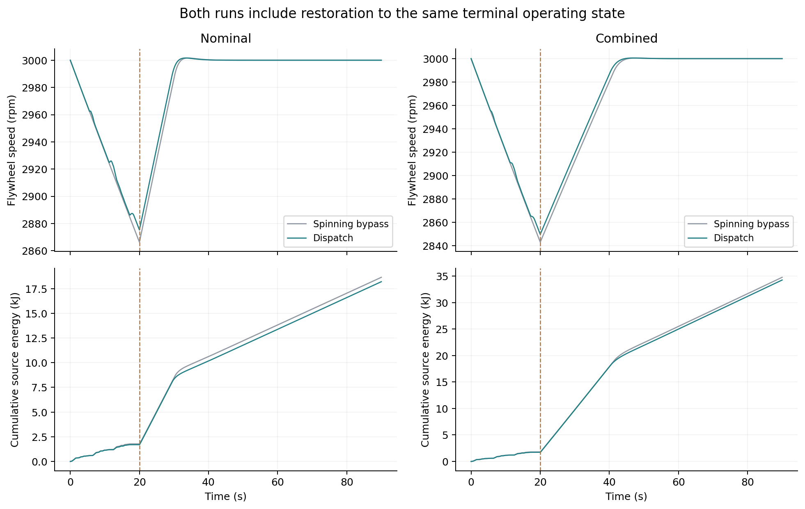

# 飞轮储能系统：固定控制器参数敏感性补充研究

本补充研究实际执行 12 组成对工况、24 次 C++ 数值仿真，比较同一列车输入下的旋转旁路与储能调度。每组统一 20 s 任务与 70 s 恢复。12 对共同终态全部有效，严格检查为 945/948，保留 3 条子账本诊断越限。

此次采用已有 accepted_core/reference_dispatch.cpp 中的方程和数值核心，不是新一次原生 MATLAB/Simulink 运行，不是硬件实验，也不是独立物理模型验证。已验收的原工程核心未修改。

**重建说明：**执行环境重置后，原研究输出丢失，本目录依据保留的研究设计与代码上下文重新运行相同 24 个工况恢复。没有新增科学工况。诊断目录内首次 876 项检查是对原检查子集的重建，已标明“重建”，不冒充丢失的原文件。

## 设置和比较协议

- 任务 0–20 s、无列车负载的恢复 20–90 s；计算更新周期 50 μs，轨迹记录周期 10 ms，每份轨迹 9001 个样本。
- 使用原 train_profile.hpp 的合成列车功率序列；每对初值、时间戳和负载逐点一致。
- 初始转速 3000 rpm、电流 0 A；母线初值等于该组源电压。Vs 组同时改变源侧初始工作点。
- 电流 PI、速度 PI、前馈和信用账本参数固定标称，未逐工况重整定；实际死区用于门极可实现性约束。
- 旁路飞轮仍旋转、承受摩擦，恢复阶段也必须补回储能；不能将它等同于拆除飞轮或静止飞轮基准。
- 共同终态要求转子、电感、电容末态储能差绝对值总和 <1e-4 J、末秒漂移 <1e-4 J，并核对负载、转速、平均电流和整体能量闭合。

| 工况 | 相对标称变化 |
|---|---|
| 标称 | 无 |
| 电枢电阻升高 | R: 0.8 → 1.0 Ω |
| 电枢电感降低 | L: 0.020 → 0.014 H |
| 转动惯量升高 | J: 0.51 → 0.65 kg·m² |
| 黏性摩擦升高 | b: 0.001 → 0.0015 N·m·s/rad |
| 恒定摩擦升高 | Tc: 0.050 → 0.075 N·m |
| 源电压降低 | Vs: 60 → 57 V；该组初始母线电压同步 |
| 源电阻升高 | Rs: 0.30 → 0.45 Ω |
| 母线电容降低 | C: 0.10 → 0.08 F |
| 摩擦组合 | b=0.0015，Tc=0.075 |
| 器件组合 | Ron=0.03 Ω，Rd=0.015 Ω，Vf=0.8 V，死区=2 μs |
| 综合偏差 | 上述全部偏差同时施加 |

前八个偏差是单因素或源侧工作点扰动，后三个是组合工况，端点来自已有摩擦和综合偏差设置。这是离散单方向对照，不是连续灵敏度扫描或全局鲁棒性证明。

## 结果

节能率为（90 s 旁路源能量－90 s 调度源能量）/90 s 旁路源能量，包含恢复补能，不能称为制动回收效率。“恢复降低量”也是旁路减调度。不同参数会改变旁路能耗这个分母，所以百分比变化不代表回收能量同比例变化。

| 工况 | 90 s 源能量降低 | 降低量 J | 任务降低 J | 恢复降低 J | 相对标称百分点 |
|---|---:|---:|---:|---:|---:|
| 标称 | 2.3818% | 444.128 | 76.659 | 367.469 | +0.0000 |
| 电枢电阻升高 | 2.3141% | 469.333 | 60.282 | 409.051 | -0.0678 |
| 电枢电感降低 | 2.3815% | 444.059 | 76.372 | 367.688 | -0.0003 |
| 转动惯量升高 | 2.3948% | 447.633 | 76.980 | 370.653 | +0.0130 |
| 黏性摩擦升高 | 1.6306% | 461.398 | 69.998 | 391.400 | -0.7513 |
| 恒定摩擦升高 | 2.2232% | 447.052 | 76.549 | 370.503 | -0.1586 |
| 源电压降低 | 2.1063% | 392.974 | 59.548 | 333.426 | -0.2756 |
| 源电阻升高 | 2.4020% | 455.599 | 77.978 | 377.621 | +0.0202 |
| 母线电容降低 | 2.5444% | 475.302 | 88.071 | 387.231 | +0.1625 |
| 摩擦组合 | 1.5737% | 471.725 | 64.860 | 406.865 | -0.8082 |
| 器件组合 | 2.3721% | 444.679 | 75.333 | 369.346 | -0.0097 |
| 综合偏差 | 1.4648% | 509.326 | 58.756 | 450.570 | -0.9170 |

单因素／工作点样本中全程降低率为 1.6306%–2.5444%；综合偏差为 1.4648%。这些结论只适用于当前模型、输入和参数点。

paired_summary.csv 的母线极值统计完整 0–90 s，在每个 50 μs 更新边界观察；不能与旧报告 0–20 s 任务段、10 ms 绘图采样极值混用。综合工况全程最低约 50.528 V，包含恢复阶段补能电流；任务段约 54.35 V 是另一统计口径。

## 任务、恢复与损耗分解

loss_decomposition.csv 保留源线路、制动电阻、变换器、电机铜耗、黏性摩擦、恒定摩擦六项损耗的任务／恢复数据。正降低量表示调度减少损耗，负值表示增加。各项损耗差加末态储能差和负载差等于源能量差。

当前旋转旁路基准在任务段因摩擦降速，恢复时必须补能；调度吸收制动能量改变了补能需求。报告完整 90 s 能把这些效果计入，不能只用任务段源能量差评价收益。

## 核验与未通过项

- 检查通过 945/948；12/12 对共同终态有效。
- 最大全程能量闭合残差 9.53239942e-06 J，限值 1e-4 J。
- 最大末态储能不一致 3.17167524e-07 J，限值 1e-4 J。
- 最大末秒储能漂移 6.24293588e-07 J，限值 1e-4 J。
- 与已有原生 MATLAB 标称、摩擦、综合偏差共 6 个工况对照，源能量、损耗、末态转速/电压等字段最大绝对差 8.84756446e-09（各自原单位）；仅表示共享模型数值复现一致性，不增加独立物理证据。

**3 条严格辅助账本诊断仍未通过，不称为“全部验收通过”。** R_high_dispatch 电机恒等式峰值约 1.0556e-7 J（83.07 s）；L_low_dispatch 与 Tc_high_dispatch 变换器恒等式峰值分别约 1.0141e-7 与 1.0790e-7 J（90 s），原限值均 1e-7 J，没有为通过而改容差。对应账本绝对量之和约 3.26–3.54 万 J，相对残差约 3.1e-12。

扩展精度重新相减后残差仍存在；轨迹没有保存每个内部增量，不能证明全部由浮点累计产生。diagnostics/identity_residual_diagnostics.json 保存 0、20、40、60、80、90 s 残差及尺度。重建的 first_checks_876.json 保留原子集定义；最终额外 72 项是轨迹长度、步长及逐点输入一致性核验。

## 复现

最终位置为工程 supplemental/analysis/。在含 accepted_core/ 的工程目录执行：

    python supplemental/analysis/run_study.py --project-root . --workers 4

仅从附带完整 CSV.xz 轨迹重建报告与图：

    python supplemental/analysis/run_study.py --project-root . --analyze-only

需要 g++ C++17、Python 3、NumPy、Matplotlib；XZ 使用 Python 标准库 lzma 无损读取。执行命令、软件版本、源文件与轨迹哈希在 execution_provenance.json，编译输出在 build.log。复用文件的原 main 重命名后可能出现缺显式 return 警告；该函数不被调用，研究入口有明确返回值。

脚本先写完全部数据、报告、图，再因未通过检查返回非零退出码；这表示严格检查未全通过，不表示没有生成结果。analyze-only 同样保留该行为。原生可执行二进制不随交付附带。

实测参数、独立物理模型和硬件测试尚未由本补充研究替代。报告参数点内的结果时，应同时保留合成输入、旋转旁路、共享核心和严格账本精度边界。
