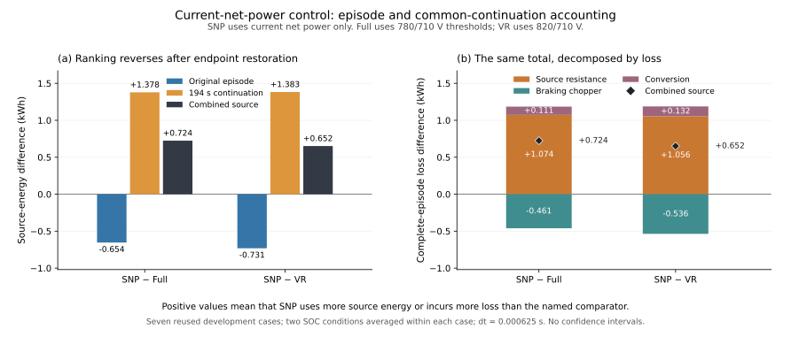
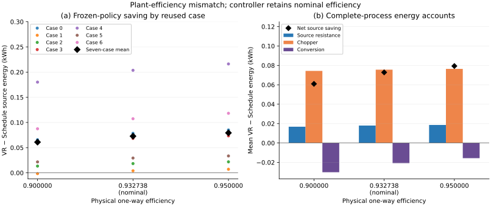
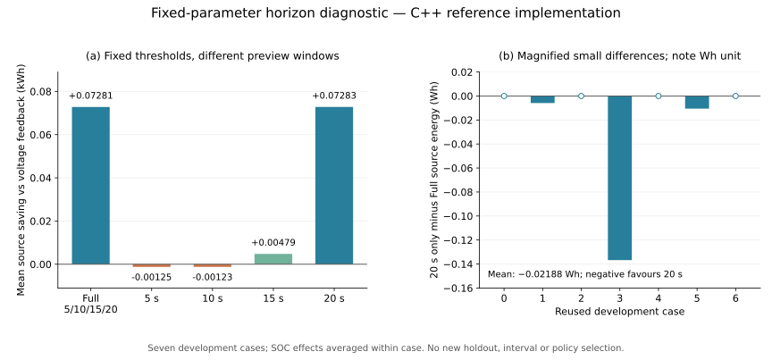

# Incremental energy benefits and limits of schedule informed flywheel dispatch in a synthetic rail DC node

> **Unpublished working manuscript · not peer reviewed.** This public copy accompanies the [research overview](README.md) and a saved-result verification subset.

Miao Cheng

Macau University of Science and Technology, Macao, China

## Abstract

A storage controller can reduce braking-resistor dissipation while increasing conversion loss or leaving a different final energy state. This study evaluates the incremental source-energy benefit of a frozen schedule-informed discharge rule in a synthetic two-train direct-current (DC) node model. Both the schedule and voltage-feedback policy families use the same storage and physical execution layer, with thresholds selected using an equal development budget. A simulated continuation restores paired storage and voltage endpoints. On 100 new synthetic scenarios, the selected schedule policy reduces mean complete-process source energy by 0.082727 kWh, with an approximate 95% interval of [0.075187, 0.090268] kWh, or 0.09889% of mean comparator supply. Additional conversion loss offsets 22.23% of combined chopper and source-resistance savings. Subsequent diagnostics reuse seven development cases. A current-net-power comparator consumes less during the original episode but more after common restoration. Changing physical one-way efficiency to 0.90, while retaining the controller's nominal efficiency assumption, preserves positive mean saving but reverses one case at both initial states. A 20 s-only horizon retains the four-horizon benefit in the examined cases. The results quantify a small conditional policy increment, its energy costs and explicit counterexamples. They do not establish calibrated railway savings, universal superiority or a necessary benefit from four horizons.

**Keywords:** regenerative braking; flywheel energy storage; schedule-informed dispatch; terminal energy; model sensitivity

## 1 Introduction

Regenerative braking creates opportunities to transfer energy between trains and storage. The usefulness of an additional storage-control feature depends on the energy that it saves relative to a credible controller already using the same device. This incremental comparison differs from the benefit of installing storage where none was present. It can also depend on when the comparison stops: a controller that returns more stored energy before the final time may appear to consume less supply while finishing with less usable energy. Conversion losses and supply-resistance losses further separate captured braking energy from reduced source consumption.

Anticipatory discharge is established in railway storage research. Zhong et al. use predicted residual braking power and remaining traction time in coordinated onboard and wayside storage control, with optimized fixed thresholds and dynamic programming as comparators [1]. Their work is a direct precedent for making storage capacity available before braking. Rigaut et al. study predictive and stochastic optimization for battery-supported subway ventilation with explicit information constraints and out-of-sample evaluation [2]. Neither preview control nor evaluation on new simulated inputs is therefore treated here as a new principle.

Flywheel studies also account for losses and final stored energy. Gee and Dunn model trackside units with voltage-responsive control, conversion loss and separate self-discharge in a distributed traction network [3]. Rupp et al. study onboard flywheel configuration and bounded charge/discharge dispatch, including a signed final-energy adjustment [4]. These models have different devices, energy definitions and electrical boundaries. Their storage-installation savings cannot be compared directly with a small change between two controllers operating the same storage device. Fletcher et al. also report marginal rail-storage savings and explain how additional storage throughput and the accounting boundary can alter net-energy comparisons [5]. These general loss and boundary concerns are established context, rather than new principles claimed here.

The question examined here is narrower: **how much complete-process source energy does one frozen nominal-schedule rule save beyond a development-selected voltage-feedback policy, and which accounting and modelling choices limit that advantage?** The comparison is conditional on prescribed train power, a lumped DC node and a declared terminal continuation. The schedule rule is a heuristic, not an optimizer; its nominal plan is frozen before the operating inputs change. The original independent test estimates the selected policy-family contrast. Later analyses are explicitly descriptive and do not become new confirmatory tests merely because they examine a new explanation.

Three results organize the study. First, the independent synthetic test quantifies a small positive mean increment and the conversion-throughput cost that offsets part of it. Second, a causal current-net-power comparator provides a concrete example of source-energy ranking reversal when common terminal restoration is included. Third, developmental diagnostics identify a low-efficiency counterexample and show that four horizons are unnecessary to obtain the observed benefit in these cases. These are findings about the declared comparison; they do not establish a new control principle or superiority to predictive optimization.

## 2 Model and evaluation design

### 2.1 Train inputs and electrical boundary

Two trains traverse a synthetic 2750 m route with segment lengths of 850, 1000 and 900 m. Speed ceilings are 70, 80 and 75 km/h. Acceleration requests are 1, 1 and 0.9 m/s²; braking deceleration is 1 m/s²; station dwell times are 18, 20 and 22 s. The nominal mass is 203000 kg per train. The train solver limits acceleration using available traction power and chooses cruising duration, or a lower reachable peak speed, to preserve the station positions when mass changes. It uses midpoint mechanical power and distance integration with event-aligned partial intervals and a maximum train step of 0.0025 s.

Train resistance is

\[
F_R(v)=(1.2414+0.0144u+0.000221u^2)mg/1000,
\]

where force is in N, velocity $v$ is in m/s, $u=3.6v$ is in km/h and $g=9.81$ m/s². Traction and regenerative conversion efficiencies are 0.9. Each train has a 200 kW auxiliary load and a 3 MW magnitude limit on net bus power. Electrical braking is disabled below 5 km/h; mechanical braking supplies the remainder of requested braking. Kinetic-energy change, resistance, braking, auxiliaries and conversion are retained in the train energy accounts.

The two interval traces are aligned while preserving their energy integrals. Let $d(t)$ and $r(t)$ be summed positive demand and regenerative offer. Direct exchange is $\min(d,r)$; the resulting prescribed net demand is $p(t)=d(t)-r(t)$. These traces do not respond to computed DC voltage. Thus the model evaluates controllers under fixed train inputs; it does not simulate the feedback of voltage-dependent power restrictions into train motion or a spatial railway network.

The electrical model contains a unidirectional source, source resistance, DC capacitor, storage converter and chopper. The source voltage is 750 V, resistance is 0.02 Ω and capacitance is 1.5 F. Positive storage-bus power $p_f$ charges storage. All powers below are in W. Source current and chopper power are

\[
i_s(V)=\max\{(750-V)/0.02,0\},\qquad
p_\mathrm{ch}(V)=\min\{250000[V-900]_+,4000000\},
\]

with $[x]_+=\max(x,0)$. Each integration subinterval solves the capacitor-energy equation

\[
\frac{C_\mathrm{dc}}2(V_{n+1}^2-V_n^2)
=\Delta t[\overline{V} i_s(\overline{V})-p-p_f-p_\mathrm{ch}(\overline{V})],\qquad
\overline{V}=(V_n+V_{n+1})/2.
\]

The energy accounts use the same midpoint quantities. A bracketed Newton solve operates within 450–1100 V. Failure is recorded without a voltage clamp; this numerical domain is not a certified operating range.

### 2.2 Storage and shared feedback

Usable internal storage energy is $E\in[0,C_u]$ kWh, with $C_u=4.5$ kWh and usable SOC $s=E/C_u$. Both converter directions are limited to 1 MW. Nominal one-way efficiencies are $\eta_c=\eta_d=\sqrt{0.87}$. For bus charge and discharge magnitudes $p_c=[p_f]_+$ and $p_d=[-p_f]_+$, internal power and conversion loss are

\[
p_\mathrm{int}=\eta_c p_c-p_d/\eta_d,\qquad
\ell_\mathrm{conv}=(1-\eta_c)p_c+(1/\eta_d-1)p_d.
\]

At zero rotor loss, $\dot E=p_\mathrm{int}/(3.6\times10^6)$ when time is in seconds. The factor converts W to internal kWh per second. The initial voltage is 750 V and initial SOC is either 0.55 or 0.85.

Both policy families use voltage feedback with effective thresholds $u_c=\theta_c+35(s-0.5)$ and $u_d=\theta_d+35(s-0.5)$. Above $u_c$, raw feedback charges with gain 90000 W/V; below $u_d$, it discharges with the same gain; otherwise it commands zero. Raw power is limited to the converter rating. After any schedule modification, the command is multiplied once by a directional taper,

\[
a_+(s)=\operatorname{clip}_{[0,1]}((0.98-s)/0.05),\qquad
a_-(s)=\operatorname{clip}_{[0,1]}((s-0.02)/0.05).
\]

These soft limits reduce requests near the upper and lower operating levels. Separate event handling enforces hard energy bounds. A requested reserve therefore does not certify that a transfer can be executed.

### 2.3 Frozen schedule rule

The nominal plan uses two nominal-mass trains separated by 35 s. Its forecast interface receives only the plan and clock time. Actual current power, voltage and SOC enter feedback, but actual future power, mass, departure offset and episode end do not update the forecast.

For nominal net demand $p_0(t)$, the planned regenerative opportunity is $g_0(t)=\min([-p_0(t)]_+,10^6)$. It is the regeneration remaining after direct exchange, capped by charging power. Its cumulative internal-energy equivalent and reserve are

\[
I_0(t)=\frac{\eta_c}{3.6\times10^6}\int_0^t g_0(\tau)\,d\tau,
\]

\[
R_h(t)=\min\{4.32,[I_0(t+h)-I_0(t)]_+\},\qquad
h\in\{5,10,15,20\}\ \mathrm{s}.
\]

The cumulative function is constant outside nominal-plan support. The 4.32 kWh limit equals $(0.98-0.02)C_u$. This reserve sums positive future net regeneration; it does not subtract intervening traction energy or predict future taper, voltage, chopper action or rotor losses. It is a heuristic opportunity signal, not a guaranteed future headroom requirement.

Available headroom to the soft upper limit is $A=[0.98C_u-E]_+$ and each deficit is $D_h=[R_h-A]_+$. When current net demand is positive and raw voltage feedback is noncharging, the rule computes

\[
P_\mathrm{need}=\max_h\frac{\eta_d(3.6\times10^6)D_h}{h},\qquad
P_\mathrm{pre}=\min(P_\mathrm{need},10^6,[p]_+).
\]

It replaces the raw command by $\min(p_\mathrm{VR,raw},-P_\mathrm{pre})$ and then applies the shared taper once. Otherwise, voltage feedback is preserved, including charging priority. The maximum follows division by each horizon: the largest energy deficit alone does not define the most demanding power request. Multiplication by discharge efficiency converts an internal energy reduction into the bus energy returned. The current-demand cap limits the added schedule request; it does not cap an already larger reactive discharge. Commands update every 0.01 s and are held between updates, subject to execution constraints.

### 2.4 Complete process energy comparison

Each operating episode is followed by the same 194 s continuation with 200 kW demand. A common restoration controller returns storage to its initial energy using at most ±100 kW bus power and then maintains that state. This is a deliberately specified comparison service, not a measured railway timetable continuation. No run receives a selectively extended continuation.

For zero rotor loss, the common terminal voltage is the high-voltage solution of $V(750-V)/0.02=200000$. With rotor loss, maintaining the target energy also requires bus power; the right-hand side includes that maintenance demand. Comparability requires restoration by 174 s, final energy error at most $10^{-8}$ kWh, final voltage error at most $10^{-6}$ V and energy-account residuals below $10^{-6}$ kWh. The target voltage is shared within a paired condition.

The primary outcome is source energy over the original episode and continuation,

\[
Q=\frac1{3.6\times10^6}\int 750i_s\,dt.
\]

Saving is $Q^\mathrm{VR}-Q^\mathrm{Sch}$, so positive values favor Schedule. Original-episode and continuation energies are also reported separately. For runs sharing external demand and restored storage/capacitor endpoints, source-energy differences reconcile with differences in source-resistance, chopper, conversion and, where present, rotor losses. Less chopper energy alone is not sufficient evidence of less source consumption.

This metric differs from an algebraic credit assigned to terminal energy. It includes the actual source-resistance and conversion losses of the declared restoration process. Its ranking is consequently conditional on that process; equal treatment within pairs does not make the continuation representative of every possible future service.

### 2.5 Development and independent synthetic evaluation

The seven development cases are nominal masses at 35 s separation and each mass-factor pair (0.95,1.05), (1.05,0.95) and (1,1) at separations of 32.5 and 37.5 s. Both families receive the same nine threshold candidates: charge thresholds of 780, 800 and 820 V and discharge thresholds of 690, 710 and 730 V. Each selects one global pair minimizing mean complete-process source energy across cases and both initial SOCs at the finer integration step. Ties within $10^{-8}$ kWh favor the smallest L1 distance in volts from the default 800/710 V pair, followed by lower charge and discharge thresholds. The selected settings are VR 820/710 V and Schedule 780/710 V. This finite search does not establish globally optimal controllers.

These settings are frozen before 100 new synthetic scenarios are generated. Two mass factors are drawn independently and uniformly from [0.95,1.05]; train separation is drawn independently from [32.5,37.5] s. A dedicated MT19937 stream uses seed 2026091701. The primary effect first averages the two SOC-specific differences within each scenario,

\[
\delta_i=\frac12\sum_{s\in\{0.55,0.85\}}(Q_{i,s}^\mathrm{VR}-Q_{i,s}^\mathrm{Sch}).
\]

The mean receives the approximate interval

\[
\overline{\delta}\pm t_{0.975,99}\,\frac{\operatorname{SD}(\delta_1,\ldots,\delta_{100})}{\sqrt{100}}.
\]

The inferential sample size is 100. SOC repetitions and integration steps are not independent samples. This interval describes the mean under the declared zero-rotor-loss generator and nominal conversion efficiency; it does not include model discrepancy. A secondary descriptive comparison applies 820/710 V to both families to examine addition of the schedule rule at common thresholds. The primary comparison remains the separately selected families.

### 2.6 Subsequent diagnostics and numerical checks

Later diagnostics reuse the seven development cases. They do not enlarge the independent sample or carry its interval to another plant. Policies remain frozen; no favorable diagnostic outcome is used to replace the tested policy. Table 1 distinguishes the questions and evidence populations.

**Table 1. Evaluation scope.** SOC0 denotes initial usable SOC. All developmental diagnostics use SOC0 of 0.55 and 0.85 and both DC integration steps.

| Evaluation | Inputs and comparison | Interpretation |
|---|---|---|
| Primary test | 100 new scenarios; selected VR and Schedule | Approximate interval for the generator-specific mean |
| Common thresholds | Same 100 scenarios; both at 820/710 V | Descriptive sensitivity to the selected threshold difference |
| Current net power | Seven reused cases; sampled net power versus selected policies | Causal-comparator and terminal-accounting diagnostic |
| Plant efficiency | Seven reused cases; actual efficiency 0.90, nominal, 0.95 | Model mismatch with nominal controller efficiency retained |
| Rotor loss | Seven reused cases; four assumed loss rates | Assumption sensitivity, separate from the main test |
| Horizon and timing | Seven reused cases; declared rule variants | Descriptive limits on complexity and timing claims |

The current-net-power policy commands the clipped negative of sampled present net demand, then applies the same directional SOC taper once. It uses no future information and no voltage threshold. The plant, initial states and restoration procedure are shared. In the efficiency diagnostic, physical charge/discharge conversion changes symmetrically, while the controller's efficiency and nominal reserves remain at $\sqrt{0.87}$. The 0.90 and 0.95 values occur as assumptions in different flywheel studies [3,4]; they are not an empirically established range for this device. Rotor loss is zero in this diagnostic.

The separate rotor branch assumes total kinetic energy $K=E+1.5$ kWh. The chosen minimum-to-maximum speed ratio of 0.5 and usable capacity imply a maximum total energy of 6 kWh; this is an assumed window, not identification of rotor inertia. A loss law $L(K)=1000\lambda K$ W uses $\lambda\in\{0,0.01,0.1,1\}$ h⁻¹. With time in seconds,

\[
\dot K=\frac{p_\mathrm{int}}{3.6\times10^6}-\frac{\lambda K}{3600}.
\]

The affine solution and integrated loss are evaluated analytically between events. Minimum-speed and terminal-target maintenance draw bus energy and incur conversion loss. Parameters are illustrative; conversion and rotor losses are separate accounts. The predictor remains unchanged across rates.

The horizon ablation retains only one of the four horizons while preserving other settings. The timing diagnostic instead uses common 780/710 V thresholds and compares the original plan, ZeroPlan and four circular plan rearrangements within a declared [20,270) s window. The shifts are 30 or 60 s in either direction. They preserve reserve-row values but alter timing, commands and execution; they do not isolate information value at matched actions or represent a validated forecast-error distribution.

Original studies were executed in MATLAB. Subsequent horizon, timing, expanded net-power and efficiency diagnostics use a C++ reference implementation with retained sources and inputs. Before new diagnostic conditions run, required baseline records are checked against saved native results. DC steps of 0.00125 and 0.000625 s retain event alignment. Individual energy and voltage step tolerances are 0.005 kWh and 0.1 V; resolved effect signs use a $10^{-6}$ kWh zero tolerance. These are comparison diagnostics, not rigorous global error bounds. Failures and negative effects remain in the record; required failures withhold aggregate claims rather than remove unfavorable observations. An additional C++ replay from the recovered native inputs matches the archived physical summary metrics for all 1,200 policy/state/step records; this is reproduction of the same 100 scenes. Supplementary material gives implementation, provenance and execution details.

## 3 Results

### 3.1 Magnitude and energy cost of the independent increment

The primary mean source-energy saving is 0.082727 kWh, with an approximate 95% interval of [0.075187,0.090268] kWh. Mean VR supply including continuation is 83.655774 kWh; the mean saving is therefore 0.09889% of this comparator. This percentage is an increment between policies already using the same storage, not the saving from installing storage. All 100 scenario-average effects are positive in this realized test bank, with a range of 0.018408–0.180571 kWh. This observation does not imply universal positive performance or a field-reliability guarantee.

Mean original-episode saving is 0.083674 kWh. Additional continuation consumption offsets 0.000947 kWh, leaving the primary value above. Thus the positive mean was not created by the restoration segment. The interval excludes zero under the specified sampling model, but the physically small magnitude remains an essential part of the result.

The common-threshold descriptive mean is 0.081942 kWh. Its closeness to the primary result shows that the observed increment is not explained solely by the two families selecting different thresholds. It still measures the addition of this particular frozen rule, not the independent value of future information. Examining the change from Schedule 820/710 V to 780/710 V gives only 0.000785 kWh mean improvement, and 64 of the 100 scene effects worsen. A slightly better mean therefore coexists with worse performance in most scenes for that threshold change; the original policy selection is retained.

Figure 1 summarizes the independent scenario effects and their mean loss decomposition.

**Figure 1.** Independent synthetic test at nominal efficiency and zero rotor loss. Each point in panel (a) averages the two initial SOC conditions within one scene and is sorted only for display. The shaded band is the approximate interval for the mean, not a prediction interval for individual scenes. Panel (b) gives complete-process mean loss savings; positive values favor Schedule and negative conversion saving denotes additional conversion loss.

### 3.2 Throughput cost and source energy accounting

Mean chopper and source-resistance savings are 0.086068 and 0.020313 kWh. Schedule incurs an additional 0.023653 kWh of conversion loss, offsetting 22.23% of their combined saving. The residual is the 0.082727 kWh net benefit. These values show why recovery or resistor energy alone would overstate the incremental source benefit.

For symmetric efficiency $\eta$ and restored internal energy at zero rotor loss, integrated bus charging and discharging satisfy $Q_d=\eta^2Q_c$. Conversion loss consequently satisfies

\[
L_\mathrm{conv}=\gamma(Q_c+Q_d),\qquad
\gamma=\frac{1-\eta^2}{1+\eta^2}.
\]

This is an energy-accounting identity, not a new control theorem. At nominal efficiency, $\gamma=0.0695187$. The selected schedule policy adds 0.340245 kWh of complete-process bus throughput on average, consistent with its additional conversion loss. Other dissipation terms must more than compensate for that cost to obtain a net source saving.

**Table 2. Primary complete-process mean energy differences.** Values are VR minus Schedule; negative values favor VR. The period split and loss split are alternative accounts of the same total and must not be added together.

| Account | Mean difference in kWh |
|---|---:|
| Original source energy | 0.083674 |
| Continuation source energy | −0.000947 |
| Complete source energy | 0.082727 |
| Complete chopper loss | 0.086068 |
| Complete source-resistance loss | 0.020313 |
| Complete conversion loss | −0.023653 |

No hard storage-capacity rejection is demonstrated in the observed original episodes of the main test or rotor diagnostic. This does not make the SOC taper irrelevant: the soft upper limit and state-dependent feedback affect transfers before a hard bound is reached. It does mean that attributing the complete benefit to prevention of hard overflow would exceed the recorded evidence. The accounts establish the combined energetic outcome, without uniquely allocating it to individual controller mechanisms.

### 3.3 Terminal restoration reverses the net power comparator ranking

Across seven reused development cases, the sampled current-net-power policy uses 0.654007 kWh less source energy than Schedule during the original episode, averaging first over SOC conditions and then over cases. Its continuation consumption is 1.378446 kWh greater. Its complete-process consumption is therefore **0.724439 kWh greater** than Schedule. Against selected voltage feedback, the original advantage is 0.731465 kWh and the continuation penalty is 1.383099 kWh, leaving a complete penalty of 0.651634 kWh.

The ranking reversal occurs in all 14 case/SOC conditions for each comparator. These are repeated conditions from seven deterministic development cases, not 14 independent observations or an estimated success probability. The policies end their original episodes with different storage states; lower original supply alone does not represent matched delivered service.

The complete loss accounts provide the corresponding electrical explanation. Relative to Schedule, the net-power policy reduces chopper loss by 0.460622 kWh but increases source-resistance and conversion losses by 1.073639 and 0.111422 kWh. Their signed sum is its source penalty. The original/continuation split and this dissipation split describe the same result, so the continuation energy must not be added again to the complete losses.

Figure 2 separates the current-net-power comparison into original and restoration periods.

**Figure 2.** Sampled net-power policy minus Schedule or selected VR on seven reused cases. Panel (a) separates original, continuation and complete source-energy differences. Panel (b) decomposes the complete difference into losses. Positive values favor Schedule or VR over the net-power comparator. The two panels are alternative accounts; neither is an independent statistical replication. Values use the finer reference step.

This diagnostic broadens the causal comparisons but does not demonstrate superiority to every causal policy. In particular, the ranking remains conditional on the specified subsequent load and restoration rule. It should not be interpreted as evidence that instantaneous power balancing always fails or that another terminal-energy objective is incorrect.

### 3.4 Physical efficiency mismatch exposes a negative condition

The physical-efficiency diagnostic begins with 56 fresh nominal regressions and adds 112 changed-efficiency records. The controller and forecast reserves retain nominal efficiency throughout. At the finer step, mean source saving is 0.060963 kWh at physical one-way efficiency 0.90, 0.072805 kWh at nominal efficiency and 0.079347 kWh at 0.95. These means belong to the development grid, not the independent test.

At efficiency 0.90, Case 1 gives negative savings of approximately −0.001603 kWh at each initial SOC. Both integration steps retain the sign. The same case saves approximately 0.004090 kWh at nominal efficiency and 0.007105 kWh at 0.95. Thus positive mean performance does not extend to conditionwise superiority under the tested mismatch. No sampled policy difference lies within $10^{-6}$ kWh of zero; the observations do not identify an interpolated critical efficiency or performance at untested values.

**Table 3. Physical efficiency mismatch with a frozen controller.** Means first average the two SOC conditions within each case, then seven reused cases. Negative counts are conditions, not independent scenarios.

| Physical one-way efficiency | Mean saving in kWh | Minimum condition saving in kWh | Negative conditions |
|---|---:|---:|---:|
| 0.900000 | 0.060963 | −0.001603 | 2 of 14 |
| Nominal $\sqrt{0.87}$ | 0.072805 | 0.004090 | 0 of 14 |
| 0.950000 | 0.079347 | 0.007105 | 0 of 14 |

At efficiency 0.90, mean source-resistance and chopper savings are 0.016784 and 0.074320 kWh, offset by 0.030142 kWh of additional conversion loss. Additional conversion loss is 0.020758 kWh at nominal efficiency and 0.015644 kWh at 0.95. The accounting coefficient $\gamma$ rises to 0.104972 at 0.90 and falls to 0.051248 at 0.95. Physical feedback also changes executed throughput and other losses; these results are not obtained simply by rescaling an unchanged action trace.

Figure 3 reports the tested efficiency conditions and their loss accounts.

**Figure 3.** Plant-efficiency mismatch with frozen nominal controller efficiency and reserves. Panel (a) shows each reused case averaged across two initial SOCs and the seven-case mean. Markers denote only tested efficiencies. Panel (b) gives complete-process mean loss savings and net source saving. Positive values favor Schedule. No inferential interval or continuous crossover estimate is shown.

All 168 execution, ledger and endpoint checks, 84 individual-step checks and 98 paired-step checks pass. The largest checked paired-source step change is below $3.99\times10^{-6}$ kWh and the largest complete-process ledger residual is below $8.97\times10^{-9}$ kWh. These findings make the negative condition numerically resolvable at the tested resolutions; they do not validate a physical device or transfer the primary interval to another efficiency.

### 3.5 Limits of horizon complexity and other sensitivity results

With other parameters fixed, the 20 s-only rule has a mean developmental source saving of 0.072827 kWh, compared with 0.072805 kWh for the four-horizon rule. The difference is only 0.02188 Wh in favor of the single horizon. The 5 s and 10 s variants instead have negative means of approximately −0.001245 and −0.001230 kWh; the 15 s variant gives 0.004793 kWh. These results do not support four horizons as a necessary source of additional energy benefit in the examined cases. They also do not justify replacing the primary policy after observing its test results or carrying its interval to a newly chosen horizon.

Figure 4 compares the horizon variants on the reused development cases.

**Figure 4.** Horizon diagnostic in the C++ reference implementation. Panel (a) gives mean complete-process saving relative to selected VR. Panel (b) magnifies the 20 s-minus-Full difference after averaging the two SOCs within each case; its unit is Wh. Positive values in panel (b) favor Full, so negative values favor the 20 s variant. Open circles denote exact exported zero differences. No new independent inference or policy selection is made.

A subsequent accounting replay of Full and the 20 s-only policy (H20) separates this small difference into operating and restoration periods. Full uses 3.340890 Wh less mean source energy in the original episode, but 3.362768 Wh more in restoration, leaving a complete-process excess of 0.021878 Wh. The remaining difference is dominated by source-resistance loss; complete-process conversion-loss differences are negligible. Thus an additional original-episode discharge does not by itself establish additional overall cycling loss. This is a post-hoc description of the same seven development cases, with no further policy selection or independent sample. Supplementary Section S8 gives the checkpoints, energy identities and numerical checks.

Two additional diagnostics delimit broader claims. Under assumed rotor losses, mean saving declines from 0.072805 kWh at zero loss to 0.067574 kWh at $1$ h⁻¹, a 7.185% reduction. The weakest condition loses 70.16% of its saving and retains only 0.001220 kWh; its chopper dissipation slightly increases. Positive mean performance therefore hides materially greater weakness in one condition. The rates are illustrative assumptions, and the highest rate is not assigned to a named flywheel product.

In the common-threshold timing diagnostic, the aligned plan saves a mean 0.074024 kWh relative to ZeroPlan. All four declared plan rearrangements have worse means, but advancing by 30 s improves Case 2 at both SOCs. Most of the penalties for the delayed plans arise during restoration. These interventions demonstrate sensitivity to the particular plan timing and continuation. Because actions also change, they do not isolate pure information value at matched actions, show universally optimal alignment or establish robustness to realistic forecasting errors. Supplementary Figures S1–S3 retain the rotor, timing and threshold-level detail.

## 4 Discussion

### 4.1 What a small positive mean establishes

The independent test resolves a positive average incremental effect under the specified generator. The common-threshold contrast weakens the explanation that the result comes solely from different selected thresholds. The energy decomposition shows a more specific trade-off: additional storage throughput incurs conversion loss, while chopper and supply-resistance savings provide the offset. This is a description of the tested rule's behavior, not identification of a universally useful information advantage.

The approximately 0.1% source increment is small. Its uncertainty interval concerns synthetic scenario variability with the model held fixed. Neither that interval nor the step checks quantify uncertainty in real train inputs, converter performance, rotor losses or network resistance. Consequently, statistical separation from zero and numerical consistency do not establish that the magnitude exceeds physical model error. Operational annual savings or payback cannot be inferred without corresponding operating and cost data.

The later diagnostics are informative because they restrict, rather than simply repeat, the positive mean claim. The efficiency counterexample excludes conditionwise dominance at the examined low efficiency. The short-horizon negative means and the very small observed difference for the 20 s-only rule exclude a demonstrated need for four horizons. The timing exception excludes universal optimality of nominal alignment. These findings remain conditional and descriptive; they do not supply another independent test population.

### 4.2 Terminal energy is part of the evaluation question

Prior work explicitly addresses terminal energy. Sumpavakup et al. impose equal initial and final onboard-storage SOC [6, Eq. (27)]. Zhong et al. arrange initial/final SOC consistency in their optimization setup [1]. Gee and Dunn discuss residual energy and use discharge-efficiency credit in their single-train example [3]. Rupp et al. subtract the increase in total kinetic energy from catenary consumption [4, Eq. (45)]. Rigaut et al. choose zero terminal cost because their stated objective is indifferent to end-of-day SOC [2]. A different terminal objective is not automatically an accounting error.

The present continuation instead asks how much source energy each policy needs to perform the operating episode and a common restoration service. The net-power ranking reversal illustrates why that question differs from minimizing original-episode supply. It does not prove that every alternative terminal valuation is inappropriate. The restoration load and horizon are chosen comparison conditions; their inclusion in development selection also makes the selected policies specific to that objective.

In the primary test, extra continuation consumption only slightly reduces the average original benefit. In weaker cases and causal-baseline comparisons, terminal treatment is much more consequential. Reporting both period accounts therefore matters even when one complete-process scalar is used for selection. Source-resistance and converter losses of restoration must be counted once and kept distinct from a hypothetical credit for unused energy.

### 4.3 Physical scope and relation to prior models

The study's electrical plant is one common node driven by prescribed train inputs. It lacks position-dependent line impedances and voltage feedback into train operation. Gee and Dunn use a distributed network and compare a specified simulation interval with circuit simulators, while leaving real light-rail validation to future work [3]. Rupp et al. compare no-storage energy-consumption estimates with operator-reported values per distance [4]. Those validation statements cannot be transferred to this uncalibrated plant.

The storage parameters are not jointly identified from one device. Rupp et al.'s 0.90 conversion assumption excludes bearing and windage losses; their SOC is normalized total kinetic energy [4]. Here SOC is usable energy above minimum speed. Gee and Dunn's 0.95 conversion efficiency and separate 25% hourly self-discharge are distinct assumptions [3]. Retaining 75% after one hour corresponds to an exponential coefficient of $-\ln(0.75)=0.287682$ h⁻¹, not 0.25 h⁻¹. Combining selected assumptions across studies would not produce a calibrated flywheel.

A commercial railway flywheel specification provides an example of a 0.5 minimum/maximum speed ratio, but its 125 kW module and approximately 0.52 kWh energy rating do not jointly calibrate the present 1 MW and 4.5 kWh usable-energy assumptions [7]. Published standby-loss analysis also emphasizes configuration-dependent losses [8]. Electrical auxiliary demand, a measured torque–speed envelope, efficiency maps and startup/shutdown behavior remain outside the current storage model. The separate efficiency and rotor diagnostics do not establish their joint effect or an empirical uncertainty range.

### 4.4 Contribution and remaining boundaries

The contribution is a quantified evaluation of one policy increment under an explicit comparison protocol, with retained energy costs and counterexamples. Reproducibility and fair comparisons support the credibility of those findings; they are not new physical principles. The current-net-power comparator expands the causal assessment, while the selected voltage-feedback and common-threshold comparisons address specific baseline concerns. None establishes superiority to all causal policies, the coordinated predictive method in [1], MPC or an optimal dispatch solution.

The independent test remains confined to nominal conversion efficiency, zero rotor loss and modest mass/separation variation. Later cases reuse development inputs. No conformal-coverage guarantee is asserted, and earlier experiments using another model are not incorporated as evidence for this one. Artificial plan shifts do not replace realistic prediction-error evaluation. These restrictions define the scope within which the numerical comparison is interpretable.

## 5 Conclusion

The frozen nominal-schedule rule yields a mean complete-process source saving of 0.082727 kWh, approximately 0.09889% of selected voltage-feedback supply, in the specified independent synthetic test. Additional conversion loss offsets part of the benefit. Reused-case diagnostics show a terminal-accounting ranking reversal for a current-net-power comparator, a negative condition under physical efficiency mismatch and no demonstrated advantage of four horizons over 20 s alone. The resulting evidence supports a small conditional policy increment with explicit limits. It does not establish general operational savings, optimal control or calibrated flywheel performance.

## Use of generative AI

OpenAI ChatGPT/Codex assisted with model and experiment formulation, generation and revision of simulation and analysis code, numerical cross-checking, literature searching, and manuscript drafting and editing. Its use extended beyond language copy editing. MATLAB outputs, Python reconstruction and C++ reference calculations are distinguished by provenance in the methods and supplementary material. AI-assisted cross-checking is not presented as independent human validation.

## Data and implementation availability

This repository publishes the primary saved MATLAB metric tables, the scenario manifest, frozen policy definitions, archived primary statistical summaries, selected historical MATLAB sources, and a Python entry point for recalculating the primary statistics and energy accounts. See [README.md](README.md) for the exact runnable scope. The Python entry point reads saved outputs; it does not run the original MATLAB or C++ simulations. The selected MATLAB sources require historical upstream configuration and output folders that are not bundled here. The subsequent seven-case diagnostic figures are retained from the working archive, but their complete input/source/output chains are not included in this public subset. The supplementary historical file index documents provenance; it is not an inventory of files publicly deposited here.

In the broader working archive, main and developmental evidence populations are kept separate. Internal pre-outcome hashes establish version consistency but do not prove an external preregistration timestamp. Recorded export and postprocessing incidents, including empty pending files, remain documented. The original 100 holdout scene MAT files and frozen nominal plan have been recovered and matched byte for byte to their historical hash manifests. Restricted decoding preserves their stored float64 values; all 100 native interval tables pass the documented input-account checks. Aggregate reconstruction, native-input reference replay and the earlier reconstructed-input diagnostics have distinct provenance. The technical discussion of Ref. [2] was checked against the versioned author manuscript arXiv:1801.03017v4.

## References

1. Zhong Z, Mi J, Zhao Y, Yang Z, Lin F. Coordinated control of the onboard and wayside energy storage system of an urban rail train based on rule mining. *Urban Rail Transit*. 2024;10:232–247. [doi:10.1007/s40864-024-00223-7](https://doi.org/10.1007/s40864-024-00223-7).
2. Rigaut T, Carpentier P, Chancelier JP, De Lara M, Waeytens J. Stochastic optimization of braking energy storage and ventilation in a subway station. *IEEE Transactions on Power Systems*. 2019;34(2):1256–1263. [doi:10.1109/TPWRS.2018.2873919](https://doi.org/10.1109/TPWRS.2018.2873919).
3. Gee AM, Dunn RW. Analysis of trackside flywheel energy storage in light rail systems. *IEEE Transactions on Vehicular Technology*. 2015;64(9):3858–3869. [doi:10.1109/TVT.2014.2361865](https://doi.org/10.1109/TVT.2014.2361865).
4. Rupp A, Baier H, Mertiny P, Secanell M. Analysis of a flywheel energy storage system for light rail transit. *Energy*. 2016;107:625–638. [doi:10.1016/j.energy.2016.04.051](https://doi.org/10.1016/j.energy.2016.04.051).
5. Fletcher DI, Harrison RF, Nallaperuma S. TransEnergy – a tool for energy storage optimization, peak power and energy consumption reduction in DC electric railway systems. *Journal of Energy Storage*. 2020;30:101425. [doi:10.1016/j.est.2020.101425](https://doi.org/10.1016/j.est.2020.101425).
6. Sumpavakup C, Ratniyomchai T, Kulworawanichpong T. Optimal energy saving in DC railway system with on-board energy storage system by using peak demand cutting strategy. *Journal of Modern Transportation*. 2017;25:223–235. [doi:10.1007/s40534-017-0146-6](https://doi.org/10.1007/s40534-017-0146-6).
7. VYCON. REGEN The proven flywheel energy storage system for rail. Manufacturer brochure. January 2018. [Manufacturer specification](https://vyconenergy.com/wp-content/uploads/2018/06/VYCON-REGEN-KINETIC-BROCHURE_4_page_NEW_web-single-pagesNEWBRAND.pdf).
8. Amiryar ME, Pullen KR. Analysis of standby losses and charging cycles in flywheel energy storage systems. *Energies*. 2020;13(17):4441. [doi:10.3390/en13174441](https://doi.org/10.3390/en13174441).
