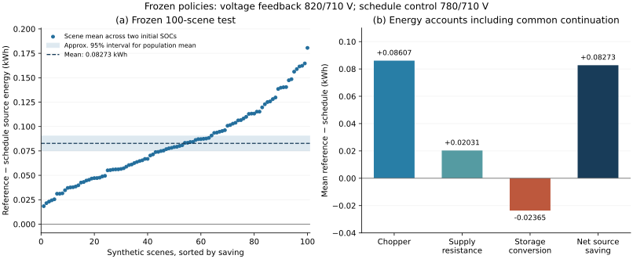

# Schedule-informed flywheel dispatch for a synthetic rail DC node

**Miao Cheng · Macau University of Science and Technology**  
**Status: unpublished simulation research / working manuscript; not peer reviewed.**

[Working manuscript](MANUSCRIPT.md) · [Supplementary material](SUPPLEMENTARY.md) · [中文说明](README_CN.md) · [Verification code](verify_results.py) · [MATLAB source notes](matlab/README.md)

## Research question

Does a frozen nominal-schedule rule reduce source energy beyond a developed voltage-feedback controller when both operate the same flywheel storage and finish at matched energy states?

This study models two trains on a synthetic 2750 m route, one lumped DC node, a unidirectional supply, braking chopper and aggregate flywheel storage. The nominal plan can request discharge before expected regeneration. Both controller families share physical limits and receive the same nine-candidate development search. Their selected settings are then frozen for a separate 100-scenario synthetic test.

This is a dispatch study using an aggregate energy model. The [motor–flywheel Simulink stages](../../README.md) are a separate workstream in this repository.

## Main result

| Primary comparison | Result |
| --- | ---: |
| Independent synthetic scenarios | 100 |
| Mean source-energy saving, voltage feedback minus schedule | 0.082727 kWh |
| Approximate 95% interval for the scenario mean | [0.075187, 0.090268] kWh |
| Saving divided by mean comparator source energy | 0.09889% |
| Mean comparator source energy | 83.655774 kWh |
| Extra conversion loss as a share of combined chopper/resistance savings | 22.23% |

The outcome includes the operating episode and a **common 194 s restoration process**, including its losses. Two initial SOC results are averaged within each scenario: the inferential sample size is **100**, not the 1,200 policy/SOC/step records. The approximate interval covers variability under the declared synthetic generator, not physical model error.



The benefit is a small increment between controllers already using the same storage. It is not the benefit of installing storage, an annual railway saving, or a measured hardware result.

## What the project investigates

- **Model and controller formulation:** power-limited train traces, DC-node energy balance, converter efficiency, SOC limits and a frozen schedule interface.
- **Fair comparison:** equal development budgets, paired operating inputs, common terminal restoration and separate loss accounts.
- **Numerical and statistical checks:** scenario-level aggregation, step-size comparisons, failed-run gates and provenance of saved outputs.
- **Limits and counterexamples:** subsequent diagnostics retain a low-efficiency negative case, a ranking reversal after terminal restoration, and no demonstrated need for four horizons over 20 s alone.

The subsequent diagnostics reuse seven development cases; they do not add independent samples to the primary test. Their figures and descriptions are in the working manuscript, but their complete replay dependencies are not included in this public subset.

## Recalculate the primary saved results

Tested with Python 3.12.14 on Linux and the packages pinned in `requirements.txt`. Use Python 3.12 for the documented environment. From this directory:

```bash
python -m venv .venv
# Activate .venv using the command for your operating system.
python -m pip install -r requirements.txt
python verify_results.py
```

The script reads archived MATLAB metric tables, checks their hashes and record structure, pairs the policies, averages within each scenario and recalculates the primary mean and interval. It also checks energy accounts and step-size differences. It prints JSON to the terminal. To save a new local output, run `python verify_results.py --output verification/local_run.json`; existing files are not overwritten. See [the retained verification result](verification/VerificationSummary.json) for the successful public-package check.

**Execution scope:** this command recalculates saved outputs. It does not run MATLAB or C++ simulations, regenerate train inputs, create new scenarios or establish field validation. The [historical MATLAB sources](matlab/README.md) are included for code inspection and require upstream files beyond this subset for execution.

## Contents and provenance

| Path | Purpose |
| --- | --- |
| `MANUSCRIPT.md` | Full working manuscript with model, methods, results, references and limitations |
| `SUPPLEMENTARY.md` | Additional accounts and diagnostics; historical archive index clearly identified |
| `figures/` | Existing study figures; primary and reused-case diagnostics are distinguished |
| `data/` | Primary archived metric tables, scenario manifest, frozen policy definitions and hashes |
| `expected/` | Archived primary summaries used as comparison targets |
| `verify_results.py` | Public saved-result verification entry point |
| `verification/` | Output retained from running that entry point |
| `matlab/` | Selected original schedule, threshold-selection and holdout sources with provenance |

The two large metric tables are losslessly gzip-compressed; their decompressed bytes preserve the archived CSVs. Expected summaries are checks against the archival record, not substitutes for recomputation from the metric tables. This subset does not contain the entire historical simulation archive, third-party papers or private review materials.

## Scope and assistance

The model is uncalibrated and uses prescribed train inputs and a lumped electrical node. It does not establish hardware performance, railway safety, universal controller superiority, an optimal policy or a conformal reliability guarantee. Integration with motor/converter dynamics and validation against operational data remain open.

OpenAI ChatGPT/Codex assisted with model and experiment formulation, simulation and analysis code, numerical cross-checking, literature searching, and manuscript drafting and editing. Assistance extended beyond language editing. AI-assisted cross-checking is not presented as independent human validation. MATLAB outputs, Python recomputation and historical C++ reference calculations have distinct provenance, as documented in the manuscript and source notes.
