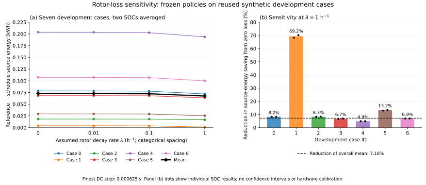
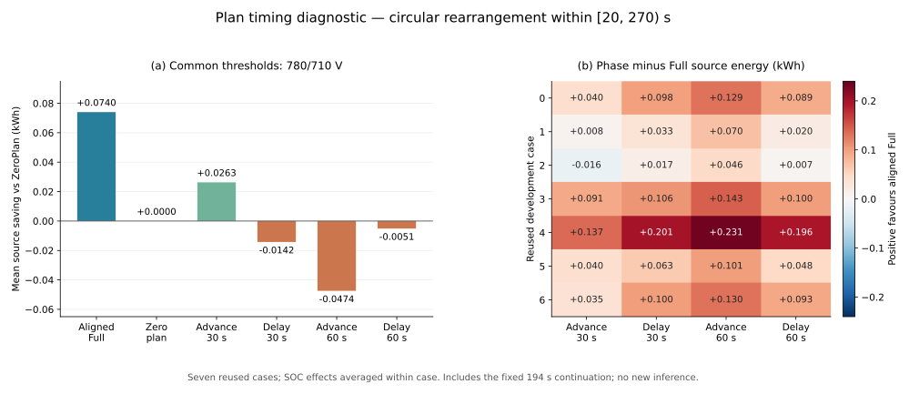
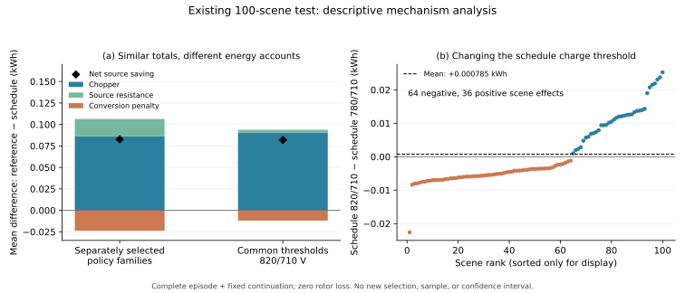
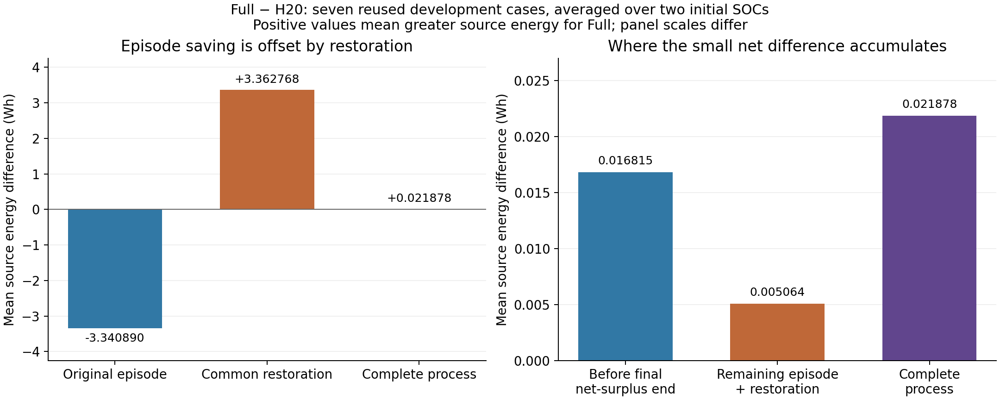

# Supplementary material

> **Companion to an unpublished working manuscript.** See [the public overview](README.md). The verification script here covers the primary saved-result statistics and accounts. Section S7 describes the broader historical working archive; listed files and reference replays are not all included or executable in this public subset.

**Incremental energy benefits and limits of schedule informed flywheel dispatch in a synthetic rail DC node**

## S1. Experimental units and evaluation counts

The primary independent evaluation and the subsequent developmental diagnostics have different statistical roles. The primary unit is one synthetic scenario, comprising independently drawn train masses and departure offset. Its effect averages the paired differences at initial SOCs 0.55 and 0.85. The two integration steps, 0.00125 and 0.000625 s, assess numerical sensitivity; they do not increase the sample size. Reported effects use the finer step unless stated otherwise.

The independent evaluation contains 100 scenarios and 1200 simulation records, including the common-threshold comparison. Its approximate Student-t interval uses 99 degrees of freedom. The scenario-effect standard deviation is 0.03800192 kWh and its standard error is 0.00380019 kWh. The relative saving reported in the article is the ratio of mean saving to mean reference supply, not the mean of scenario percentages.

The rotor, horizon, timing, current-net-power and efficiency diagnostics reuse the seven development cases. These comprise nominal masses at 35 s separation and mass-factor pairs (0.95, 1.05), (1.05, 0.95) and (1, 1), each at 32.5 and 37.5 s. Each case is evaluated at both initial SOCs. Fourteen case–SOC conditions therefore represent seven reused cases, not fourteen independent observations.

| Evaluation | Conditions per case or scenario | Simulation records | Interpretation |
|---|---|---:|---|
| Independent synthetic evaluation | Three policy settings × two SOCs × two steps | 1200 | Primary interval uses 100 scenario means |
| Rotor loss | Four decay rates × two policies × two SOCs × two steps | 224 | Development sensitivity |
| Horizon diagnostic | Five schedule variants and VR × two SOCs × two steps | 168 | Development ablation |
| Horizon accounting replay | Full and H20 × two SOCs × two steps | 56 | Post-hoc decomposition of existing cases |
| Plan timing | Six variants × two SOCs × two steps | 168 | Development timing diagnostic |
| Current-net-power comparison | Three policies × two SOCs × two steps | 84 | Development comparator |
| Efficiency mismatch | Three physical efficiencies × two policies × two SOCs × two steps | 168 | Development sensitivity |

Repeated baseline records occur across diagnostic groups. These counts must not be summed into an enlarged independent sample. No additional confidence intervals or policy selection are based on these diagnostics.

## S2. Terminal restoration and energy identities

Every reported complete-process comparison includes the original episode and the fixed 194 s continuation described in the article. The continuation imposes 200 kW demand, restores initial usable storage energy with at most ±100 kW bus power, and then maintains that energy. Restoration must finish by 174 s. Final energy and voltage tolerances are $10^{-8}$ kWh and $10^{-6}$ V, respectively; the energy-account tolerance is $10^{-6}$ kWh. A failed condition cannot be repaired by selectively extending its continuation.

With rotor decay, target maintenance consumes bus power

\[
P_\mathrm{maint}=\frac{1000\lambda(E_*+1.5)}{\eta_c},
\]

where $E_*$ is target usable energy in kWh and $\lambda$ is in $\mathrm{h}^{-1}$. The common terminal voltage is the high-voltage root of

\[
V(750-V)/0.02=200000+P_\mathrm{maint}.
\]

For zero decay, $P_\mathrm{maint}=0$. This terminal voltage differs from the initial 750 V. Accordingly, the individual-run account retains capacitor-energy change:

\[
Q=W_\mathrm{train}+W_\mathrm{tail}+L_R+L_\mathrm{ch}+L_\mathrm{conv}
 +L_\mathrm{rot}+\Delta E+\Delta E_C+\varepsilon.
\]

Here $W_\mathrm{train}$ is signed net train-bus demand, $W_\mathrm{tail}$ is continuation load energy, and $\varepsilon$ is the numerical residual. Initial and final energy terms cancel in a paired difference only when the corresponding endpoints agree. Source energy includes source-resistance and conversion losses during restoration; an algebraic credit for remaining energy is a different metric.

Let $A$ and $B$ denote complete-process bus charging and discharging energies, and let $T=A+B$. For equal one-way efficiencies $\eta$,

\[
\Delta E+L_\mathrm{rot}=\eta A-B/\eta,
\qquad
L_\mathrm{conv}=(1-\eta)A+(1/\eta-1)B.
\]

Eliminating $A$ and $B$ gives the accounting identity

\[
L_\mathrm{conv}=\frac{1-\eta^2}{1+\eta^2}T
-\frac{(1-\eta)^2}{1+\eta^2}(\Delta E+L_\mathrm{rot}).
\]

Under restored energy and zero rotor loss, $B=\eta^2A$. At nominal efficiency, $B=0.87A$ and $L_\mathrm{conv}=0.13A=0.0695187T$. Thus additional executed throughput carries a calculable conversion cost. This follows from the declared constant-efficiency model and is not an independent empirical finding.

The current-net-power comparator illustrates the consequence of the stopping rule. Its mean source difference from Full is −0.654007 kWh during the original episode but +1.378446 kWh during continuation, giving +0.724439 kWh overall. Relative to VR, the corresponding values are −0.731465, +1.383099 and +0.651634 kWh. Both comparisons reverse sign in all fourteen case–SOC conditions. These reversals apply to the specified restoration service; they do not establish a ranking for every possible subsequent timetable.

## S3. Rotor-loss sensitivity and the weakest retained condition

Rotor kinetic energy is $K=E+1.5$ kWh, with maximum $K=6$ kWh. The assumed law is

\[
\dot K=p_\mathrm{int}/(3.6\times10^6)-\lambda K/3600,
\qquad \ell_\mathrm{rot}=1000\lambda K\ \mathrm{W}.
\]

Analytical propagation under constant internal power is split at storage events. Rates of 0, 0.01, 0.1 and 1 $\mathrm{h}^{-1}$ correspond to maximum losses of 0, 60, 600 and 6000 W. These are illustrative sensitivity settings, not measured device parameters. The thresholds and nominal plan remain fixed.

At $\lambda=1$ $\mathrm{h}^{-1}$, mean saving falls from 0.07280540 to 0.06757434 kWh, a 7.185% reduction. The weakest retained result is Case 1 at SOC 0.85: saving falls from 0.00409010 to 0.00122047 kWh, a **70.16% reduction**. Its signed loss contributions are +0.01296701 kWh from source resistance, −0.00080709 kWh from chopper dissipation, −0.01030334 kWh from conversion and −0.00063612 kWh from rotor loss. Positive net saving therefore coexists with increased chopper, conversion and rotor losses. Original-episode saving of approximately 0.006778 kWh is largely consumed by an additional continuation cost of 0.005558 kWh.

**Figure S1.** Rotor sensitivity on seven reused cases. Panel (a) averages the two SOC effects within each case. Panel (b) shows percentage reductions in SOC-averaged savings and individual SOC points at $\lambda=1$ $\mathrm{h}^{-1}$. The 70.16% maximum concerns Case 1 at SOC 0.85 specifically. The dashed line denotes reduction of the overall mean, not a confidence limit.

## S4. Plan timing and the Case 2 exception

The timing diagnostic circularly rearranges the four reserve columns together within [20, 270) s. This window contains 25000 controller rows at 0.01 s spacing and all nonzero reserve values. Advances or delays of 30 and 60 s preserve the row multiset and time-weighted reserve integrals, but alter state-dependent actions. Values outside the window remain unchanged. Circular seams make this a signal-timing diagnostic rather than a realistic distribution of timetable errors.

Every arm uses 780/710 V thresholds. ZeroPlan is therefore same-threshold voltage feedback, distinct from the selected 820/710 V VR comparator. Mean savings relative to ZeroPlan are:

| Plan | ZeroPlan minus plan source energy (kWh) |
|---|---:|
| Full | +0.07402374 |
| Advance 30 s | +0.02628391 |
| Delay 30 s | −0.01424138 |
| Advance 60 s | −0.04742851 |
| Delay 60 s | −0.00510286 |

Full has the lowest mean, but Advance30 improves on Full in Case 2 at both SOCs: the case-average improvement is 0.01620742 kWh. This is one case-level exception. Delay30, Advance60 and Delay60 increase source energy relative to ZeroPlan in all fourteen conditions. The fixed continuation remains included in every comparison.

**Figure S2.** Panel (a) reports savings relative to same-threshold ZeroPlan. Panel (b) reports phase-minus-Full differences after averaging SOC effects within each case; negative values favor the shifted plan. The negative Case 2/Advance30 cell is retained. No independent-sample uncertainty is assigned to these reused cases.

## S5. Threshold comparison and adverse scenario effects

The selected-family comparison changes both the schedule feature and charge threshold. A descriptive common-threshold comparison separates these choices without selecting another policy. Lowering Schedule's charge threshold from 820 to 780 V saves only 0.00078498 kWh on average across the original 100 scenarios. It worsens 64 scenario means and improves 36. Effects range from −0.02262913 to +0.02523224 kWh, where positive values favor 780 V.

The mean threshold-change account comprises −0.00458143 kWh chopper saving, +0.01717102 kWh source-resistance saving and −0.01180461 kWh conversion saving. This small positive mean therefore does not indicate that lowering the threshold consistently reduces dissipation. Neither the adverse scenarios nor the extra conversion cost is removed from the reported totals.

**Figure S3.** Panel (a) compares signed mean loss accounts for separately selected policies and the common 820/710 V setting. Diamonds represent net source saving and are not additional components. Panel (b) sorts the 100 scenario-average threshold effects for display; sorting has no role in analysis. Negative points identify the 64 scenarios worsened by the lower Schedule charge threshold.

## S6. Physical efficiency mismatch with frozen controller assumptions

The efficiency diagnostic changes physical charge and discharge efficiencies together to 0.90 or 0.95, retaining nominal $\sqrt{0.87}$ as the controller's efficiency assumption. Planned reserves, horizon calculations, thresholds and taper are unchanged. Physical conversion, storage evolution and restoration use the changed efficiency. State feedback can consequently alter executed actions: a frozen controller does not imply identical power trajectories. Rotor loss remains zero.

The values are sensitivity assumptions informed by different flywheel models [3,4], not an experimentally established range for one device. Mean complete-process savings are 0.06096263, 0.07280540 and 0.07934708 kWh at one-way efficiencies 0.90, nominal and 0.95, respectively. At 0.90, Case 1 reverses at both initial SOCs: −0.001602672 kWh at SOC 0.55 and −0.001602676 kWh at SOC 0.85. Both signs persist at both integration steps. These are two state-specific results from one case, not two independent failed scenarios.

Positive means therefore coexist with an explicit adverse condition. The diagnostic does not identify a critical efficiency by interpolation, retune the controller, or estimate a joint rotor-loss/efficiency sensitivity surface.

## S7. Implementation, numerical checks and file index

Primary and rotor-loss results originate from MATLAB outputs. Python reconstruction independently recalculates their statistics and accounts; it does not rerun MATLAB. The earlier seven-case horizon, timing, current-net-power and efficiency diagnostics use a separate C++ reference implementation and full-precision NPZ traces from the Python reference generator. Their input provenance remains distinct from the subsequently recovered native holdout MAT files.

The primary maximum reconstructed complete-process residual is $9.95\times10^{-9}$ kWh; its largest SOC-specific paired change between steps is $4.77\times10^{-6}$ kWh. All 224 rotor records pass their ledger and endpoint criteria. Timing's maximum paired step change is $1.80\times10^{-6}$ kWh; efficiency's is below $3.99\times10^{-6}$ kWh. Two-step agreement tests numerical consistency at those resolutions, not a rigorous global error bound. Small residuals establish accounting closure, not physical calibration.

The C++ diagnostics retain source, protocol, input hashes and raw results, and compile without fast-math. CSV postprocessing uses round-trip float parsing where exact SOC keys are required. Temporary export remnants are retained and reconciled with final files; they are not additional outcomes. The historical file index distinguishes reconstructing reported numbers from replaying complete trajectories; it does not list the contents of this public subset.

| Purpose | Historical files or directories relative to the working-archive data root |
|---|---|
| Primary statistics and paired accounts | `holdout_verified/RecomputedResultSummary.json`; `RecomputedEnergyDecomposition.csv`; `RecomputedSceneEnergyDecomposition.csv` in the same directory |
| Native inputs and reference replay | `native_recovery/`: input-hash and table audits, restricted MAT reader; `replay/`: frozen protocol, raw outputs and verification |
| Upstream development-input recovery | `schedule_recovery_20260918/RecoveryVerification.json`; `read_schedule_mat.py`; `audit_schedule.py` in the same directory |
| Native-output reconstruction | `holdout_verified/independent_holdout_audit.py`; `rotor_verified/independent_rotor_audit.py`; accompanying `native_inputs/` directories |
| Rotor sensitivity | `rotor_verified/Rotor_Recomputed_Results.json`; `rotor_verified/native_inputs/RotorSummary.csv` |
| Threshold mechanism | `mechanism_analysis/EnergyMechanism_Means.csv`; `MatchedThreshold_Scene_Mechanism.csv` in the same directory |
| Horizon and timing protocols/results | `mechanism_analysis/horizon_reference/`; `timing_analysis/reference/` |
| Horizon accounting replay | `horizon_loss_audit/Protocol.json`; `Verification.json`; `PairedSegments.csv`; `CheckpointOutputs.zip` in the same directory |
| Current-net-power implementation/results | `netpower_analysis/NetPowerProtocol.json`; `netpower_analysis/PairedEffects.csv`; `netpower_analysis/source/` |
| Efficiency implementation/verification | `efficiency_analysis/EfficiencyProtocol.json`; `efficiency_analysis/source/`; `fulltext_review/IndependentEfficiencyVerification.json`; `fulltext_review/Efficiency_Paired_Savings_Independent.csv` |

All 101 recovered native input files match the historical byte counts and SHA-256 hashes. A restricted reader preserves the stored float64 arrays, and all 100 scene-input checks pass. The unchanged C++ source replays 1,200 records from these inputs and the frozen plan. Across 33 energy/state and seven voltage entries per record, maximum discrepancies from archived summaries are $8.08\times10^{-10}$ kWh and $1.97\times10^{-9}$ V, below prespecified tolerances of $10^{-6}$ kWh and $10^{-5}$ V. These entries include algebraically derived states. The packet retains 600 raw process files and 800 paired comparisons. Command proxies and solver counters are excluded. This establishes neither pointwise trajectory identity nor another independent sample. Complete per-step train mechanical states were not saved. The complete upstream Schedule archive was subsequently recovered, including `NominalPlan.mat` and all seven `Case00_Input.mat`–`Case06_Input.mat` files. Its 17 shared review files are byte-identical to the archived review packet. All eight plan fields equal the separately recovered frozen plan, and recomputing the cumulative plan from the stored nominal node gives zero discrepancy. Across 1,438,309 stored development intervals, node power accounts close exactly in the extraction check; integrated net train energy differs from archived summaries by at most $1.06\times10^{-10}$ kWh. The earlier reconstructed development traces are close but not bitwise identical to these native inputs. Their diagnostic provenance is therefore retained. This closes the identified input-file availability gap; it does not establish unchanged top-level MATLAB execution.

## S8 Horizon accounting across operating and restoration periods

This post-hoc diagnostic examines Full against H20 on the same seven development cases, after the horizon results and same-state command differences had been inspected. Both policies use 780/710 V thresholds, the original controller and execution equations, two initial SOCs and two integration steps. Additional observers read accumulated energy accounts at existing integration boundaries. They do not introduce new integration steps or provide future information to the controller. Execution uses the C++ reference and the earlier reconstructed development NPZ inputs. The 56 policy–SOC–step records are repetitions of existing conditions, not new independent scenarios or MATLAB executions.

Table S1 gives Full minus H20 source energy at the finer step. Each case value first averages its two SOC conditions. Positive differences mean that Full consumes more. Four cases have identical accounts; the mean complete-process excess is only 0.021878 Wh.

**Table S1. Source energy differences between Full and H20.** All values are in Wh. The original episode and the 194 s restoration sum to the complete process; displayed rounding can affect the last digit.

| Case | Original episode | Restoration | Complete process |
|---|---:|---:|---:|
| 0 | 0.000000 | 0.000000 | 0.000000 |
| 1 | −4.578713 | +4.584582 | +0.005869 |
| 2 | 0.000000 | 0.000000 | 0.000000 |
| 3 | −11.157432 | +11.294183 | +0.136751 |
| 4 | 0.000000 | 0.000000 | 0.000000 |
| 5 | −7.650083 | +7.660610 | +0.010527 |
| 6 | 0.000000 | 0.000000 | 0.000000 |
| Mean | −3.340890 | +3.362768 | +0.021878 |

For a temporal decomposition, each trajectory is split at the end of its last input interval with strictly negative net train demand. This actual future boundary is used only for offline accounting. Source energy accumulated up to that boundary contributes 0.016815 Wh to the mean Full-minus-H20 difference; the remaining original period plus restoration contributes 0.005064 Wh. The earlier component is 76.86% of the total and occurs in Case 3. Cases 1 and 5 differ only after their final net-surplus boundary. These are accumulated temporal accounts, not isolated interventions establishing the causal contribution of one command pulse. Absence of later negative train demand also does not preclude brief storage charging from capacitor and voltage dynamics.

**Figure S4.** Full minus H20 mean source energy on seven reused development cases, averaging initial SOCs within cases. Panel (a) separates original operation, restoration and the complete process. Panel (b) separates accounting up to the final net-surplus boundary from the remaining original period plus restoration. The panels use different vertical scales and show alternative decompositions of the same total. Positive values favor H20. Values are descriptive and have no independent-sample uncertainty interval.

Mean complete-process source-resistance, chopper and conversion-loss differences are +0.021880878, −0.000003155 and +0.000000408 Wh, respectively. Source resistance dominates. In Cases 1 and 5, complete-process charge and discharge agree within numerical precision: additional original-episode discharge is offset by less restoration discharge.

For fixed efficiencies and zero rotor loss, let $A$ and $B$ denote complete-process bus charging and discharging energies as in Section S2, and let $\delta$ denote Full minus H20. Equal initial and terminal storage energy gives

\[
\eta_c\delta A-\delta B/\eta_d=0.
\]

Consequently,

\[
\delta L_\mathrm{conv}
=(1-\eta_c)\delta A+(1/\eta_d-1)\delta B
=(1-\eta_c\eta_d)\delta A.
\]

Equal complete-process charge implies equal conversion loss despite different discharge timing. Source-resistance loss can still change with the current trajectory. This model identity requires modification for time-varying efficiency or rotor losses.

All 1456 original-output field comparisons, 288 checkpoint records and common-terminal checks pass. Maximum system and paired segment-account residuals are $8.632\times10^{-9}$ and $2.171\times10^{-10}$ kWh. The largest complete-process paired step change is $1.106\times10^{-9}$ kWh. These are numerical consistency checks, not rigorous global error bounds or device validation. Raw checkpoints, hashes and reconstruction scripts are retained.

The primary Schedule–VR contrast, with its 22.23% conversion offset, is unchanged. Full–H20 is a different comparison. This diagnostic establishes neither practical significance nor H20 optimality, and does not explain all mechanisms of the adverse H5-only result.

**References.** Citation numbers [1]–[8] refer to the bibliography of the main article; no separate reference numbering is introduced here.

## S9 Parameter provenance and interpretation

Table S2 separates plant assumptions, controller choices and numerical settings. Source hashes and configuration locations are retained in the parameter audit. Implementation agreement establishes consistency with these values, not measurement calibration; the precise train-resistance coefficients do not identify a validated vehicle model.

**Table S2. Parameter roles in the synthetic comparison.** Values are fixed unless the relevant diagnostic explicitly changes them. Thresholds are shown as charge/discharge pairs.

| Parameter group | Declared values | Evidence role |
|---|---|---|
| Route and motion | 850/1000/900 m; 70/80/75 km/h; acceleration 1/1/0.9 m/s²; braking 1 m/s²; dwell 18/20/22 s | Synthetic operating design |
| Train mass and resistance | 203000 kg; coefficients 1.2414, 0.0144, 0.000221 in the article's force equation | Inherited plant assumptions; no vehicle-specific fit established |
| Train conversion and limits | Traction/regeneration 0.9; auxiliaries 200 kW; net bus limit 3 MW; regeneration cutoff 5 km/h | Plant assumptions |
| Source and capacitor | 750 V; 0.02 Ω; 1.5 F; initial 750 V | Lumped plant assumptions; no feeder or capacitor measurement established |
| Chopper | Onset 900 V; gain 250 kW/V; cap 4 MW | Assumed dissipation characteristic |
| Storage | Usable capacity 4.5 kWh; bus power 1 MW in each direction; one-way efficiency $\sqrt{0.87}$ | Assumed device; no jointly calibrated hardware specification |
| Shared feedback | Gain 90 kW/V; SOC shift 35 V; soft SOC levels 0.02/0.98; taper width 0.05 | Controller design choices |
| Selected thresholds | VR 820/710 V; Schedule 780/710 V | Selected on seven development cases, then frozen |
| Plan | Nominal masses; 35 s offset; horizons 5/10/15/20 s | Information and controller design; reserve cap 4.32 kWh is derived from soft SOC span |
| Primary generator | Mass factors uniform on [0.95,1.05]; offset uniform on [32.5,37.5] s; seed 2026091701 | Declared synthetic sampling distribution, not an observed operating distribution |
| Restoration | 194 s; load 200 kW; storage bus limit ±100 kW | Common comparison service, not a field timetable |
| Numerical resolution | Train maximum step 0.0025 s; controller 0.01 s; DC steps 0.00125/0.000625 s; solve domain 450–1100 V | Numerical and execution settings; domain is not a safety band |

The primary interval holds plant parameters fixed. Literature comparisons and separate efficiency/rotor diagnostics do not establish a joint parameter-uncertainty interval or sensitivity to alternative source resistance and capacitance.

